# 1:1 Tutoring Session Workflow (ONE_TO_ONE)

This document provides a detailed end-to-end workflow walkthrough for **1:1 Interaction Type** sessions in the scheduling application. It details how options selected on the admin form alter the student booking experience, directory display, and backend coach assignment.

## Workflow Diagram

```mermaid
graph TD
    %% Admin Creation Flow
    subgraph Admin_Creation ["1. Admin Event Creation Form"]
        Start(["Start: Create Event Form"]) --> Basic["Enter Basic Info"]
        Basic --> LinkSession{"Link to Session Type?<br/>(Selected on form)"}
        LinkSession -- "Yes" --> SelectSessionType["Choose Session Type"]
        LinkSession -- "No" --> Location["Choose Location: Virtual / Custom / In-Person"]
        SelectSessionType --> Location
        Location --> Interaction["Select Interaction Type: 1:1"]
        Interaction --> BookingMode{"Choose Booking Mode"}
        
        %% Booking Mode branch
        BookingMode -- "Coach Availability (Dynamic)" --> Policy["Set Notice & Buffer Windows"]
        BookingMode -- "Fixed Slots (Predefined)" --> Policy
        
        %% Coach Choice branch
        Policy --> CoachChoice{"Let Students Choose Coach?"}
        
        CoachChoice -- "Yes (allowStudentCoachChoice = true)" --> CreateEvent(["Create Event"])
        
        CoachChoice -- "No" --> Strategy{"Select Assignment Strategy"}
        
        Strategy -- "Direct" --> SetDefaultHost["Select Default Event Host"]
        SetDefaultHost --> CreateEvent
        
        Strategy -- "Round Robin" --> SetPool["Define Coach Pool Size: Min/Max"]
        SetPool --> CreateEvent
    end

    %% Post Creation Configuration
    subgraph Setup_Phase ["2. Setup & Slots Configuration"]
        CreateEvent --> AddCoaches["Assign Coaches to Event"]
        AddCoaches --> RouteRouting{"Was Session Type Linked?"}
        RouteRouting -- "Yes" --> ShowDir["Event appears in public Booking Directory"]
        RouteRouting -- "No" --> DirectLink["Only accessible via Direct Event Link"]
        
        %% Slots if Fixed Slots
        ShowDir --> CheckMode{"Is Booking Mode Fixed Slots?"}
        DirectLink --> CheckMode
        
        CheckMode -- "Yes" --> AdminSlots["Admin creates predefined slots - respecting min notice window"]
        CheckMode -- "No" --> CoachAvail["Coaches define availability weekly"]
    end

    %% Student Booking Flow
    subgraph Student_Booking ["3. Student Booking Flow"]
        AdminSlots --> StudentStart(["Student visits booking page"])
        CoachAvail --> StudentStart
        
        StudentStart --> ShowCoaches{"Does Event allow Coach Choice?"}
        
        ShowCoaches -- "Yes" --> StudentSelectCoach["Student selects their preferred Coach"]
        StudentSelectCoach --> FilterSlots["System filters slots matching that Coach's schedule"]
        
        ShowCoaches -- "No" --> AutoAssign{"Is Assignment Strategy Direct?"}
        
        AutoAssign -- "Yes (Direct)" --> FilterDefaultSlots["System displays slots for the Default Host"]
        AutoAssign -- "No (Round Robin)" --> FilterAllSlots["System displays union of all coach pool slots"]
        
        FilterSlots --> SelectTime["Student selects a Date & Time"]
        FilterDefaultSlots --> SelectTime
        FilterAllSlots --> SelectTime
        
        SelectTime --> StudentForm["Student fills out Booking Details form"]
        StudentForm --> BookSession(["Book Session"])
    end

    %% Database Assignment & Confirmation
    subgraph DB_Confirmation ["4. System Processing & Assignment"]
        BookSession --> DBTransaction["Acquire Row Locks: ScheduleSlot / Event / Coach"]
        DBTransaction --> AssignResolver{"Resolve Coach Assignment"}
        
        AssignResolver -- "Coach Choice" --> ConfirmCoach["Assign Student's Selected Coach"]
        AssignResolver -- "Direct" --> ConfirmDefault["Assign Default Event Host"]
        AssignResolver -- "Round Robin" --> ConfirmRR["Assign next Coach by round-robin order - cursor-based rotation"]
        
        ConfirmCoach --> StudentRecord["Upsert Student Profile"]
        ConfirmDefault --> StudentRecord
        ConfirmRR --> StudentRecord
        
        StudentRecord --> SaveBooking["Save Booking Record Status: CONFIRMED"]
        SaveBooking --> TriggerCascades{"Triggers & Notifications"}
        TriggerCascades --> NotificationQueue["Send Email notifications to Coach & Student"]
    end
```

---

## Detailed Step-by-Step Breakdown

### 1. Admin Event Creation
An administrator (Super Admin or Team Admin) defines a scheduling category under a specific Team.
* **Basic Info**: Enters the event's name (e.g. *1:1 Tutoring Session*) and optionally links it to a `SessionType` (which determines under which directory category it displays).
* **Interaction Type**: Selects **1:1** (`ONE_TO_ONE`). Since this is selected, the application automatically hides group-specific fields like **Participant Capacity** and **Coach Reveal Delay**.
* **Booking Mode**:
  * **Coach Availability**: Bookings are dynamically created based on when the assigned coach is available (weekly schedule).
  * **Fixed Slots**: Bookings can only be made on specific dates/times pre-created by the admin.
* **Coach Choice & Assignment Strategy**:
  * If **"Let students choose their coach"** is toggled **ON**: The student picks their coach first, and the system shows that coach's availability.
  * If toggled **OFF**: The admin defines how coaches are assigned behind the scenes:
    * **Direct**: The admin designates a **Default Event Host**. All sessions are assigned to this coach.
    * **Round Robin**: The system auto-rotates the lead role among a configured pool of coaches using a cursor-based order (requires a minimum pool size of 2).

### 2. Setup & Slots Configuration
Before the event is bookable:
* The admin assigns one or more coaches to the event pool.
* If using **Fixed Slots**, the admin creates the predefined scheduling blocks.
* If using **Coach Availability**, the assigned coaches must configure their active times under their weekly availability profile.

### 3. Student Booking Flow
When a student accesses the booking path:
1. **Coach Selection** (If choice is allowed): The student views the profiles of assigned coaches and chooses one.
2. **Time Selection**: The student views a calendar of open dates/times and picks a slot.
3. **Information Intake**: The student fills in the booking form with their details (Name, Email, Timezone, Session Objectives, and Notes).

### 4. Database processing & Assignment
Once the student submits the form, the backend processes the request in a database transaction:
1. **Pessimistic Locks**: The backend locks the schedule slot/event and the coach's record to prevent concurrent double-bookings.
2. **Assignment Resolution**:
   * If coach choice was allowed: Assigns the selected coach.
   * If Direct: Assigns the default host.
   * If Round Robin: Assigns the next coach in cursor-based rotation order (`EventRoutingState.nextCoachOrder` advances on each booking).
3. **Student Profile**: The `Student` record is upserted based on email (tracking first/last booked dates).
4. **Booking Saved**: The `Booking` is saved with status `CONFIRMED`.
5. **Notifications**: Email events are queued to send confirmation links to both student and coach.

> **Note:** `SessionLog` and `SessionAttendance` records are **not** created at booking time. They are created post-session when a Super Admin, Team Admin, or the assigned coach opens the "Log Session" action and submits attendance and notes.
