# 1:N Tutoring Session Workflow (ONE_TO_MANY)

This document provides a detailed end-to-end workflow walkthrough for **1:N Interaction Type (Group Session)** in the scheduling application. It details how form configurations (Fixed Slots, Participant Capacity, and Deferred Coach Reveal) affect the setup, booking, and notification lifecycle.

## Workflow Diagram

```mermaid
graph TD
    %% Admin Creation Flow
    subgraph Admin_Creation ["1. Admin Event Creation Form"]
        Start(["Start: Create Event Form"]) --> Basic["Enter Basic Info"]
        Basic --> LinkSession{"Link to Session Type?<br/>(Selected on form)"}
        LinkSession -- "Yes" --> SelectSessionType["Choose Session Type"]
        LinkSession -- "No" --> Location["Choose Location: Virtual / Custom / In-Person"]
        SelectSessionType --> Location
        Location --> Interaction["Select Interaction Type: 1:N (One-to-Many)"]
        
        %% Auto-locks
        Interaction --> LockBookingMode["Auto-Lock: Booking Mode = Fixed Slots"]
        LockBookingMode --> LockStrategy["Auto-Lock: Assignment Strategy = Direct"]
        
        %% Capacity & Reveal Policy
        LockStrategy --> Policy["Set Notice & Buffer Windows"]
        Policy --> SetCapacity["Define Participant Capacity (Min & Max seats)"]
        SetCapacity --> DeferChoice{"Enable 'Defer Coach Reveal'?<br/>(Hide Coach & Zoom link)"}
        
        DeferChoice -- "Yes" --> CreateEvent(["Create Event"])
        DeferChoice -- "No" --> CreateEvent
    end

    %% Post Creation Configuration
    subgraph Setup_Phase ["2. Setup & Slots Configuration"]
        CreateEvent --> AddCoaches["Assign Coaches to Event Pool"]
        AddCoaches --> RouteRouting{"Was Session Type Linked?"}
        RouteRouting -- "Yes" --> ShowDir["Event appears in public Booking Directory"]
        RouteRouting -- "No" --> DirectLink["Only accessible via Direct Event Link"]
        
        %% Slots Creation (Required for Fixed Slots)
        ShowDir --> CreateSlots["Admin manually creates predefined slots"]
        DirectLink --> CreateSlots
        CreateSlots --> AssignSlotCoach["Assign specific Coach & capacity to each slot"]
    end

    %% Student Booking Flow
    subgraph Student_Booking ["3. Student Booking Flow"]
        AssignSlotCoach --> StudentStart(["Student visits booking page"])
        StudentStart --> SelectSlot["Student selects an available Fixed Slot"]
        
        SelectSlot --> CheckCap{"Is Slot Full?<br/>(maxParticipantCount reached)"}
        CheckCap -- "Yes" --> DisableBooking["Hide slot or disable booking button"]
        CheckCap -- "No" --> StudentForm["Student fills out Booking Details form"]
        
        StudentForm --> BookSession(["Book Session"])
    end

    %% Database Assignment & Confirmation
    subgraph DB_Confirmation ["4. System Processing & Confirmation"]
        BookSession --> DBTransaction["Acquire Row Lock: ScheduleSlot only - FIXED_SLOTS mode requires no event lock"]
        DBTransaction --> ValidateCap["Verify Capacity inside transaction to prevent race conditions"]
        
        ValidateCap --> StudentRecord["Upsert Student Profile"]
        StudentRecord --> SaveBooking["Save Booking Record Status: CONFIRMED"]
        SaveBooking --> CheckReveal{"Is 'Defer Coach Reveal' ON?"}
        
        %% Defer Coach Reveal Branch
        CheckReveal -- "Yes (ON)" --> ConfirmPlaceholder["Send BOOKING_CONFIRMED_DEFERRED email - no coach or URL - suppress all reminders"]
        CheckReveal -- "No (OFF)" --> ConfirmFull["Send BOOKING_CONFIRMED email with coach and Zoom link + queue reminders: 24H 12H 6H 1H"]
    end

    %% Coach Reveal Action
    subgraph Reveal_Action ["5. Coach Reveal Phase (Only if Defer Reveal is ON)"]
        ConfirmPlaceholder --> PreSession["Prior to session start"]
        PreSession --> TriggerReveal["Admin triggers Reveal - coaches can only self-reveal"]
        
        TriggerReveal --> RegisterReveal["Atomically update slot: assignedCoachId + sessionJoinUrl + coachRevealSentAt; update all active bookings coachUserId"]
        RegisterReveal --> SendRevealAlert["Queue COACH_REVEAL_SENT to all booked students + COACH_BOOKING_ASSIGNED to the coach"]
    end
```

---

## Detailed Step-by-Step Breakdown

### 1. Admin Event Creation
An administrator (Super Admin or Team Admin) defines a group scheduling category under a specific Team.
* **Interaction Type**: Selects **1:N (One-to-Many / Group Session)**.
* **Auto-Locks**: 
  * **Booking Mode**: Locked to **Fixed Slots** (`bookingMode = FIXED_SLOTS`). Because multiple participants share the same session, they must register for a pre-created calendar slot.
  * **Assignment Strategy**: Locked to **Direct**. All participants booking into a specific slot are hosted by the coach assigned to that slot.
* **Participant Capacity**: Admin sets a **Maximum** (strictly enforced; blocks bookings once reached) and a **Minimum** (informational only; does not block bookings).
* **Defer Coach Reveal**:
  * If **ON**: Students register without knowing the coach's identity or seeing the Zoom link. The reveal is triggered manually later.
  * If **OFF**: Coach and Zoom details are sent immediately upon booking confirmation.

### 2. Setup & Slots Configuration
Before the event is bookable:
* The admin assigns one or more coaches to the event pool.
* The admin **must** create specific slots (e.g. *Monday at 2:00 PM*) and assign a coach to each slot. This is mandatory for Fixed Slots mode.

### 3. Student Booking Flow
When a student accesses the booking path:
1. The student views available group slots (displaying slots and seats remaining).
2. The student selects an open slot.
3. The student fills out the booking form (Name, Email, etc.) and submits.

### 4. Database Processing & Confirmation
When the booking is submitted:
1. **Pessimistic Lock**: The system acquires a row-level lock on the `EventScheduleSlot` only. Since ONE_TO_MANY is always `FIXED_SLOTS`, no event-level lock is needed — the slot lock alone prevents concurrent overbooking.
2. The system re-checks active booking count against `maxParticipantCount` inside the transaction to prevent race conditions.
3. **If `Defer Coach Reveal` is OFF**: Sends `BOOKING_CONFIRMED` with coach name and Zoom link, and queues reminder emails at 24H, 12H, 6H, and 1H before the session.
4. **If `Defer Coach Reveal` is ON**: Sends `BOOKING_CONFIRMED_DEFERRED` (no coach name or Zoom link) and suppresses all reminder emails until the reveal is triggered.

### 5. Coach Reveal Phase
If `Defer Coach Reveal` was enabled:
1. Before the session begins, an admin (SUPER_ADMIN or TEAM_ADMIN) triggers the **Reveal** action (`POST /events/:eventId/schedule-slots/:slotId/reveal`). Coaches can call this endpoint only to reveal themselves — they cannot reveal a different coach.
2. The system runs a single atomic transaction that updates `assignedCoachId`, `sessionJoinUrl`, and `coachRevealSentAt` on the slot, **and** updates `coachUserId` on all non-cancelled bookings in the slot (so future cancellation emails correctly reference the revealed coach).
3. After the transaction, the system queues `COACH_REVEAL_SENT` emails to all registered students (with coach profile and Zoom link) and a `COACH_BOOKING_ASSIGNED` email to the revealed coach.
