# 1:N Workflow (ONE_TO_MANY)

This document provides a detailed end-to-end workflow walkthrough for **1:N Interaction Type (Group Session)** in the scheduling application. It details how form configurations (Fixed Slots, Participant Capacity, Deferred Coach Reveal, and Anonymous Booking) affect the setup, booking, notification, and session log lifecycle.

## Workflow Diagram

```mermaid
graph TD
    %% Admin Creation Flow
    subgraph Admin_Creation ["1. Admin Event Creation Form"]
        Start(["Start: Create Event Form"]) --> Basic["Enter Basic Info"]
        Basic --> LinkSession{"Link to Session Type?<br/>(Selected on form)"}
        LinkSession -- "Yes" --> SelectSessionType["Choose Session Type"]
        LinkSession -- "No" --> Interaction["Select Interaction Type: 1:N (One-to-Many)"]
        SelectSessionType --> Interaction

        %% Auto-locks
        Interaction --> LockBookingMode["Auto-Lock: Booking Mode = Fixed Slots"]
        LockBookingMode --> LockStrategy["Auto-Lock: Assignment Strategy = Direct"]

        %% Capacity & Policy
        LockStrategy --> Policy["Set Notice & Buffer Windows"]
        Policy --> SetCapacity["Define Participant Capacity (Max seats)"]
        SetCapacity --> ChooseRevealMode{"Choose Reveal / Anonymity Mode<br/>(Mutually exclusive; locked once bookings exist)"}

        ChooseRevealMode -- "Defer Coach Reveal (ON)" --> Location["Choose Location: Virtual / Custom / In-Person"]
        ChooseRevealMode -- "Anonymous Booking (ON)" --> NoteAnon["Force meetingLinkSource = EVENT_LOCATION<br/>locationValue required non-empty<br/>coachUserId stays null at booking time"]
        NoteAnon --> Location
        ChooseRevealMode -- "Neither (Standard)" --> Location

        Location --> Questions["Configure Booking Questions<br/>useDefaultQuestions toggle (default ON)<br/>Optional: up to 5 custom questions (255 chars each)"]
        Questions --> CreateEvent(["Create Event"])
    end

    %% Post Creation Configuration
    subgraph Setup_Phase ["2. Setup & Slots Configuration"]
        CreateEvent --> AddCoaches["Assign Coaches to Event Pool"]
        AddCoaches --> RouteRouting{"Was Session Type Linked?"}
        RouteRouting -- "Yes" --> ShowDir["Event appears in public Booking Directory"]
        RouteRouting -- "No" --> DirectLink["Only accessible via Direct Event Link"]

        %% Slots Creation (Required for Fixed Slots)
        ShowDir --> CreateSlots["Admin manually creates predefined slots"]
        DirectLink --> CreateSlots
        CreateSlots --> AssignSlotConfig["Set capacity per slot<br/>Assign coach per slot if NOT Anonymous Booking"]
    end

    %% Student Booking Flow
    subgraph Student_Booking ["3. Student Booking Flow"]
        AssignSlotConfig --> StudentStart(["Student visits booking page"])
        StudentStart --> SelectSlot["Student selects an available Fixed Slot"]

        SelectSlot --> CheckCap{"Is Slot Full?<br/>(maxParticipantCount reached)"}
        CheckCap -- "Yes" --> DisableBooking["Hide slot or disable booking button"]
        CheckCap -- "No" --> StudentForm["Student fills out Booking Details form<br/>(Name, Email, Notes + configured Booking Questions)"]

        StudentForm --> BookSession(["Book Session"])
    end

    %% Database Assignment & Confirmation
    subgraph DB_Confirmation ["4. System Processing & Confirmation"]
        BookSession --> DBTransaction["Acquire Row Lock: ScheduleSlot only - FIXED_SLOTS mode requires no event lock"]
        DBTransaction --> ValidateCap["Verify Capacity inside transaction to prevent race conditions"]

        ValidateCap --> StudentRecord["Upsert Student Profile"]
        StudentRecord --> SaveBooking["Save Booking Record Status: CONFIRMED"]
        SaveBooking --> CheckBookingMode{"Which mode is active?"}

        CheckBookingMode -- "Anonymous Booking (ON)" --> ConfirmAnon["coachUserId = null<br/>Send BOOKING_CONFIRMED_ANONYMOUS to student (event URL + team name, no coach)<br/>Queue ANONYMOUS_BOOKING_POOL_REMINDER to all pool coaches at configured offsets"]
        CheckBookingMode -- "Defer Coach Reveal (ON)" --> ConfirmPlaceholder["Send BOOKING_CONFIRMED_DEFERRED email - no coach or URL - suppress all reminders"]
        CheckBookingMode -- "Standard" --> ConfirmFull["Send BOOKING_CONFIRMED email with coach and join link + queue student reminders: 24H 12H 6H 1H"]
    end

    %% Slot Cancellation — Anonymous Events
    subgraph Slot_Cancellation ["5. Slot Cancellation (Anonymous Events Only)"]
        ConfirmAnon --> AdminCancelCheck{"Admin cancels the slot?"}
        AdminCancelCheck -- "Yes" --> CancelStudentNotif["Send BOOKING_CANCELLED_ANONYMOUS to each booked student - shows team name, no coach"]
        CancelStudentNotif --> NotifyPool["Send ANONYMOUS_SLOT_CANCELLED_POOL to all pool coaches"]
    end

    %% Coach Reveal Action
    subgraph Reveal_Action ["6. Coach Reveal Phase (Only if Defer Reveal is ON)"]
        ConfirmPlaceholder --> PreSession["Prior to session start"]
        PreSession --> TriggerReveal["Admin triggers Reveal - coaches can only self-reveal"]

        TriggerReveal --> RegisterReveal["Atomically update slot: assignedCoachId + sessionJoinUrl + coachRevealSentAt; update all active bookings coachUserId"]
        RegisterReveal --> SendRevealAlert["Queue COACH_REVEAL_SENT to all booked students + COACH_BOOKING_ASSIGNED to the coach"]
    end
```

---

## Detailed Step-by-Step Breakdown

### 1. Admin Event Creation
An administrator (Super Admin or Team Admin) defines a group scheduling category under a specific Team.
* **Interaction Type**: Selects **1:N (One-to-Many / Group Session)**.
* **Auto-Locks**:
  * **Booking Mode**: Locked to **Fixed Slots** (`bookingMode = FIXED_SLOTS`). Because multiple participants share the same session, they must register for a pre-created calendar slot.
  * **Assignment Strategy**: Locked to **Direct**. All participants booking into a specific slot are hosted by the coach assigned to that slot.
* **Participant Capacity**: Admin sets a **Maximum** seat count (strictly enforced; slot disappears from the booking page once reached). Leave empty for no cap — unlimited students can book the slot.
* **Reveal / Anonymity Mode** — Two mutually exclusive toggles. Both are locked (immutable) once any bookings exist (`_count.bookings > 0`):
  * **Defer Coach Reveal (ON)**: Students register without knowing the coach's identity or seeing the join URL. The coach reveal is triggered manually by an admin at a later time. All student reminder emails are suppressed until the reveal fires.
  * **Anonymous Booking (ON)**: The session is never associated with a named coach from the student's perspective. The event's shared `locationValue` URL is the only join link students receive. Enforces `meetingLinkSource = EVENT_LOCATION` (COACH_ISV option is disabled in the form) and requires a non-empty `locationValue`. A coach can be retroactively assigned only via the **Log Session** dialog post-session.
  * **Neither (Standard)**: Coach name and join URL are included in the booking confirmation email and all reminders.
* **Optional settings**:
  * `showDescription` — toggle to display the event description on the public booking page side panel.
  * `maxBookingWindowDays` — limits how far in advance students can book (1–365 days; `null` = no limit).
  * `useDefaultQuestions` / `customQuestions` — by default the event uses the system-configured default booking questions. Toggle `useDefaultQuestions` off to replace them with up to 5 per-event custom questions (max 255 chars each). Switching back to default clears the custom question list in the database. The backend resolves the effective list server-side (`effectiveBookingQuestions`) so the public booking form always receives the correct set without any client-side branching.
  * `locationLinkExpiresAt` / `locationLinkReminderDays` — for **Virtual** or **Custom** location types only. Set an expiry date for the meeting link and a pre-expiry reminder window (1–90 days). Both fields must be set together or both left empty.

### 2. Setup & Slots Configuration
Before the event is bookable:
* The admin assigns one or more coaches to the event pool.
* The admin **must** create specific slots (e.g. *Monday at 2:00 PM*) — required for Fixed Slots mode.
* For **Standard** and **Defer Reveal** events, the admin assigns a specific coach to each slot at creation time.
* For **Anonymous Booking** events, slots do not require a coach assignment at creation time — the coach is assigned retroactively when the admin (or a pool coach) logs the session after it occurs.

### 3. Student Booking Flow
When a student accesses the booking path:
1. The student views available group slots displaying seat counts.
2. The student selects an open slot.
3. The student fills out the booking form (Name, Email, Timezone, and Notes). If the event has booking questions configured (either system defaults or per-event custom questions), those appear as additional text fields. Student answers are stored as `customAnswers[]` on the `Booking` record.

The student flow is identical regardless of whether Anonymous Booking, Deferred Reveal, or Standard mode is active — the difference is entirely in the confirmation email content.

### 4. Database Processing & Confirmation
When the booking is submitted:
1. **Pessimistic Lock**: Acquires a row-level lock on the `EventScheduleSlot` only. Since ONE_TO_MANY is always `FIXED_SLOTS`, no event-level lock is needed — the slot lock alone prevents concurrent overbooking.
2. The system re-checks active booking count against `maxParticipantCount` inside the transaction to prevent race conditions.
3. **If `Anonymous Booking` is ON**: `coachUserId` is saved as `null`. Sends `BOOKING_CONFIRMED_ANONYMOUS` to the student (contains the event's shared location URL and team name — no coach name). Also queues `ANONYMOUS_BOOKING_POOL_REMINDER` notifications to **all pool coaches** at the team's configured reminder offsets (default: 1440 min / 24H and 360 min / 6H before the slot start).
4. **If `Defer Coach Reveal` is ON**: Sends `BOOKING_CONFIRMED_DEFERRED` (no coach name or join URL) and suppresses all student reminder emails until the reveal is triggered.
5. **Standard**: Sends `BOOKING_CONFIRMED` with coach name and join link, and queues student reminder emails at 24H, 12H, 6H, and 1H before the session.

### 5. Slot Cancellation (Anonymous Events)
When an admin cancels a slot on an **Anonymous Booking** event:
1. Each booked student receives a `BOOKING_CANCELLED_ANONYMOUS` email (shows team name instead of coach name).
2. All pool coaches for the event receive an `ANONYMOUS_SLOT_CANCELLED_POOL` email listing the event name and the cancelled slot time, so they know not to attend.

### 6. Coach Reveal Phase
If `Defer Coach Reveal` was enabled:
1. Before the session begins, an admin (SUPER_ADMIN or TEAM_ADMIN) triggers the **Reveal** action (`POST /events/:eventId/schedule-slots/:slotId/reveal`). Coaches can call this endpoint only to reveal themselves — they cannot reveal a different coach.
2. The system runs a single atomic transaction that updates `assignedCoachId`, `sessionJoinUrl`, and `coachRevealSentAt` on the slot, **and** updates `coachUserId` on all non-cancelled bookings in the slot (so future cancellation emails correctly reference the revealed coach).
3. After the transaction, the system queues `COACH_REVEAL_SENT` emails to all registered students (with coach profile and join link) and a `COACH_BOOKING_ASSIGNED` email to the revealed coach.

> **Session Log for Anonymous Events:** After the session, any **active pool coach** (not just an assigned coach) can open the "Log Session" action on a slot. The log dialog surfaces a **Coach Assignment** dropdown — selecting a coach atomically updates `slot.assignedCoachId` and `booking.coachUserId` on all non-cancelled bookings in a single transaction. No retroactive notification emails are sent for this assignment. Attendance per student, topics discussed, session summary, and private coach notes are recorded as normal.
>
> **`SessionLog` and `SessionAttendance` records are not created at booking time** — they are created post-session when a Super Admin, Team Admin, or eligible coach opens the "Log Session" action and submits the form.
