# N:1 Tutoring Session Workflow (MANY_TO_ONE)

This document provides a detailed end-to-end workflow walkthrough for the **N:1 Interaction Type (MANY_TO_ONE)** in the scheduling application. It details how the system supports multi-coach sessions (1 Lead Coach and 1 or more Co-Coaches/Co-Hosts) with only 1 student participant, including auto-derived leadership strategies and collaborative availability checks.

## Workflow Diagram

```mermaid
graph TD
    %% Admin Creation Flow
    subgraph Admin_Creation ["1. Admin Event Creation Form"]
        Start(["Start: Create Event Form"]) --> Basic["Enter Basic Info"]
        Basic --> LinkSession{"Link to Session Type?<br/>(Selected on form)"}
        LinkSession -- "Yes" --> SelectSessionType["Choose Session Type"]
        LinkSession -- "No" --> Interaction["Select Interaction Type: N:1 (MANY_TO_ONE)"]
        SelectSessionType --> Interaction
        Interaction --> BookingMode{"Choose Booking Mode"}
        
        %% Booking Mode branch
        BookingMode -- "Coach Availability (Dynamic)" --> Policy["Set Notice & Buffer Windows"]
        BookingMode -- "Fixed Slots (Predefined)" --> Policy
        
        %% Config locking & auto-deriving
        Policy --> SetCoHostCount["Optionally define Target Co-Host Count - null means all available co-coaches join"]
        SetCoHostCount --> Strategy{"Select Assignment Strategy"}
        
        Strategy -- "Direct" --> LockFixedLead["Auto-Lock: Leadership Strategy = Fixed Lead"]
        LockFixedLead --> SetDefaultHost["Select Default Event Host (Lead Coach)"]
        SetDefaultHost --> Location["Choose Location: Virtual / Custom / In-Person"]
        
        Strategy -- "Round Robin" --> LockRotatingLead["Auto-Lock: Leadership Strategy = Rotating Lead"]
        LockRotatingLead --> SetPool["Define Coach Pool Size (Min >= 2)"]
        SetPool --> Location
        
        Location --> CreateEvent(["Create Event"])
    end

    %% Post Creation Configuration
    subgraph Setup_Phase ["2. Setup & Availability Configuration"]
        CreateEvent --> AddCoaches["Assign Coaches to Event Pool"]
        AddCoaches --> RouteRouting{"Was Session Type Linked?"}
        RouteRouting -- "Yes" --> ShowDir["Event appears in public Booking Directory"]
        RouteRouting -- "No" --> DirectLink["Only accessible via Direct Event Link"]
        
        %% Slots/Availability depending on Booking Mode
        ShowDir --> CheckMode{"Is Booking Mode Fixed Slots?"}
        DirectLink --> CheckMode
        
        CheckMode -- "Yes" --> AdminSlots["Admin creates predefined slots - respecting min notice window"]
        CheckMode -- "No" --> CoachAvail["All Pool Coaches define availability weekly"]
    end

    %% Student Booking Flow
    subgraph Student_Booking ["3. Student Booking Flow"]
        AdminSlots --> StudentStart(["Student visits booking page"])
        CoachAvail --> StudentStart
        
        StudentStart --> AutoAssign{"Is Assignment Strategy Direct?"}
        
        AutoAssign -- "Yes (Direct)" --> FilterDefaultSlots["System displays times where Default Host is available"]
        AutoAssign -- "No (Round Robin)" --> FilterAllSlots["System displays times where next Lead Coach in rotation is available"]
        
        FilterDefaultSlots --> SelectTime["Student selects a Date & Time"]
        FilterAllSlots --> SelectTime
        
        SelectTime --> StudentForm["Student fills out Booking Details form"]
        StudentForm --> BookSession(["Book Session"])
    end

    %% Database Assignment & Confirmation
    subgraph DB_Confirmation ["4. System Processing & Assignment"]
        BookSession --> DBTransaction["Acquire Row Locks: Event + Lead Coach (COACH_AVAILABILITY) or ScheduleSlot + Lead Coach (FIXED_SLOTS) - co-coaches not hard-locked"]
        DBTransaction --> AssignLead{"Resolve Lead Coach Assignment"}
        
        AssignLead -- "Direct" --> AssignFixedLead["Assign Default Event Host as Lead Coach"]
        AssignLead -- "Round Robin" --> AssignRRLead["Assign next Coach in Round-Robin order as Lead Coach"]
        
        AssignFixedLead --> AssignCoHosts["Query pool and assign available co-coaches up to Target Co-Host Count (Rotates via nextCoachOrder)"]
        AssignRRLead --> AssignCoHosts
        
        AssignCoHosts --> StudentRecord["Upsert Student Profile"]
        StudentRecord --> SaveBooking["Save Booking Record Status: CONFIRMED (with Lead & Co-Coaches)"]
        SaveBooking --> NotificationQueue["Send BOOKING_CONFIRMED to student + COACH_BOOKING_ASSIGNED to lead + COACH_BOOKING_COCOACH_ASSIGNED to each co-coach + queue student reminders: 24H 12H 6H 1H"]
    end
```

---

## Detailed Step-by-Step Breakdown

### 1. Admin Event Creation
An administrator (Super Admin or Team Admin) configures a multi-coach session under a specific Team.
* **Interaction Type**: Selects **N:1 (MANY_TO_ONE)**.
* **Capacity Constraint**: Auto-locked by validation schema to **exactly 1 participant** (`maxParticipantCount = 1`).
* **Session Leadership Reform**: The `sessionLeadershipStrategy` cannot be selected manually. Instead, it is auto-derived from the `assignmentStrategy` selection:
  * **Direct**: Automatically locked to **Fixed Lead** (`FIXED_LEAD`). The admin must specify a `fixedLeadCoachId` (the Default Event Host).
  * **Round Robin**: Automatically locked to **Rotating Lead** (`ROTATING_LEAD`). The lead role rotates automatically.
* **Target Co-Host Count**: Optional. When set (must be `>= 1`), caps the number of co-coaches assigned per session. When left as `null`, all available coaches in the pool (excluding the lead) join each session as co-coaches.
* **Booking Mode**: Enforces no restriction, so admins can select **Coach Availability** (dynamic booking based on coach schedules) or **Fixed Slots** (pre-created times).
* **Optional settings**:
  * `showDescription` — toggle to display the event description on the public booking page side panel.
  * `maxBookingWindowDays` — limits how far in advance students can book (1–365 days; `null` = no limit).

### 2. Setup & Availability Configuration
Before students can book a session:
* The admin assigns multiple coaches to the event pool.
* If using **Fixed Slots**, the admin creates slots and assigns a specific coach.
* If using **Coach Availability**, the assigned coaches configure their weekly schedules via their **User Profile → Availability tab**. There is no event-level availability override — coach weekly availability is the sole authority over when slots are generated for that event.

### 3. Student Booking Flow
When a student visits the booking page:
1. The student views available times.
2. The system displays times where the **lead coach** is available. Co-host availability is checked at booking time (not at the slot display step) and degrades gracefully — if fewer co-coaches than `targetCoHostCount` are available, the booking proceeds with however many are free.
3. The student selects an available slot and submits the booking details.

### 4. Database Assignment & Confirmation
Once the booking is submitted, the backend processes it in a single transaction:
1. **Row Locks**: For `COACH_AVAILABILITY` (the default): locks the `Event` row + the lead coach's `User` row. For `FIXED_SLOTS`: locks the `ScheduleSlot` row + the lead coach's `User` row. Co-coaches are **not** hard-locked — they are availability-checked only.
2. **Lead Coach Assignment**: Resolves the Lead Coach based on the strategy (Direct gets the Default Host; Round-Robin selects the next coach in order).
3. **Co-Host Selection**: The system queries the pool, filters out the Lead Coach, and identifies available co-coaches up to the `targetCoHostCount` parameter. It rotates co-host assignments based on `nextCoachOrder`.
4. **Graceful Degradation**: If fewer co-coaches than requested are available, the system logs a warning but proceeds with booking the Lead Coach (and any available co-coaches).
5. **Confirmation**: Upserts the student record, saves the `Booking` with `coachUserId` (Lead) and `coCoachUserIds`, then queues: `BOOKING_CONFIRMED` to the student, `COACH_BOOKING_ASSIGNED` to the lead coach, `COACH_BOOKING_COCOACH_ASSIGNED` to each co-coach, and reminder emails to the student at 24H, 12H, 6H, and 1H before the session.

> **Session Log:** After the session, a Super Admin, Team Admin, or the assigned lead coach (or any assigned co-coach) can open the "Log Session" action on the slot. The log records attendance per student, topics discussed, session summary, and private coach notes. `SessionLog` and `SessionAttendance` records are **not** created at booking time — they are written only when the log is explicitly submitted post-session.
