# N:N Tutoring Session Workflow (MANY_TO_MANY)

This document provides a detailed end-to-end workflow walkthrough for the **N:N Interaction Type (MANY_TO_MANY)** in the scheduling application. It details how the system supports collaborative group sessions where multiple coaches (1 Lead Coach and 1 or more Co-Coaches/Co-Hosts) host multiple student participants in predefined slots.

## Workflow Diagram

```mermaid
graph TD
    %% Admin Creation Flow
    subgraph Admin_Creation ["1. Admin Event Creation Form"]
        Start(["Start: Create Event Form"]) --> Basic["Enter Basic Info"]
        Basic --> LinkSession{"Link to Session Type?<br/>(Selected on form)"}
        LinkSession -- "Yes" --> SelectSessionType["Choose Session Type"]
        LinkSession -- "No" --> Location["Choose Location: Virtual / Custom / In-Person"]
        SelectSessionType --> Location
        Location --> Interaction["Select Interaction Type: N:N (MANY_TO_MANY)"]
        
        %% Auto-locks
        Interaction --> LockBookingMode["Auto-Lock: Booking Mode = Fixed Slots"]
        LockBookingMode --> SetCoHostCount["Optionally define Target Co-Host Count - null means all available co-coaches join"]
        SetCoHostCount --> SetCapacity["Define Participant Capacity (Min & Max seats)"]
        SetCapacity --> Strategy{"Select Assignment Strategy"}
        
        Strategy -- "Direct" --> LockFixedLead["Auto-Lock: Leadership Strategy = Fixed Lead"]
        LockFixedLead --> SetDefaultHost["Select Default Event Host (Lead Coach)"]
        SetDefaultHost --> CreateEvent(["Create Event"])
        
        Strategy -- "Round Robin" --> LockRotatingLead["Auto-Lock: Leadership Strategy = Rotating Lead"]
        LockRotatingLead --> SetPool["Define Coach Pool Size (Min >= 2)"]
        SetPool --> CreateEvent
    end

    %% Post Creation Configuration
    subgraph Setup_Phase ["2. Setup & Slots Configuration"]
        CreateEvent --> AddCoaches["Assign Coaches to Event Pool"]
        AddCoaches --> RouteRouting{"Was Session Type Linked?"}
        RouteRouting -- "Yes" --> ShowDir["Event appears in public Booking Directory"]
        RouteRouting -- "No" --> DirectLink["Only accessible via Direct Event Link"]
        
        %% Slots Creation (Required for Fixed Slots)
        ShowDir --> CreateSlots["Admin manually creates predefined slots"]
        DirectLink --> CreateSlots
        CreateSlots --> AssignCapacity["Optionally assign per-slot capacity - falls back to event maxParticipantCount"]
    end

    %% Student Booking Flow
    subgraph Student_Booking ["3. Student Booking Flow"]
        AssignCapacity --> StudentStart(["Student visits booking page"])
        StudentStart --> SelectSlot["Student selects an available Fixed Slot"]
        
        SelectSlot --> CheckCap{"Is Slot Full?<br/>(maxParticipantCount reached)"}
        CheckCap -- "Yes" --> DisableBooking["Hide slot or disable booking button"]
        CheckCap -- "No" --> StudentForm["Student fills out Booking Details form"]
        
        StudentForm --> BookSession(["Book Session"])
    end

    %% Database Assignment & Confirmation
    subgraph DB_Confirmation ["4. System Processing & Assignment"]
        BookSession --> DBTransaction["Acquire Row Lock: ScheduleSlot only - coaching team is shared across all participants so no coach lock needed"]
        DBTransaction --> ValidateCap["Verify capacity inside transaction to prevent race conditions"]
        
        ValidateCap --> CheckExisting{"Is this the first booking for this slot?"}
        
        %% New Session Path
        CheckExisting -- "Yes (First Booking)" --> AssignLead{"Resolve Lead Coach Assignment"}
        AssignLead -- "Direct" --> AssignFixedLead["Assign Default Event Host as Lead Coach"]
        AssignLead -- "Round Robin" --> AssignRRLead["Assign next Coach in Round-Robin order as Lead Coach"]
        
        AssignFixedLead --> AssignCoHosts["Query pool and assign available co-coaches up to Target Co-Host Count (Rotates via nextCoachOrder)"]
        AssignRRLead --> AssignCoHosts
        
        %% Reuse Coaching Team Path
        CheckExisting -- "No (Subsequent Booking)" --> ReuseTeam["Retrieve and assign the exact same Lead & Co-Coaches team assigned to the first booking"]
        
        AssignCoHosts --> StudentRecord["Upsert Student Profile"]
        ReuseTeam --> StudentRecord
        
        StudentRecord --> SaveBooking["Save Booking Record Status: CONFIRMED"]
        SaveBooking --> NotificationQueue["Send BOOKING_CONFIRMED + reminders 24H/12H/6H/1H to student; COACH_BOOKING_ASSIGNED to lead; COACH_BOOKING_COCOACH_ASSIGNED to each co-coach - fired per booking not per slot"]
    end
```

---

## Detailed Step-by-Step Breakdown

### 1. Admin Event Creation
An administrator defines a collaborative group session under a Team.
* **Interaction Type**: Selects **N:N (MANY_TO_MANY)**.
* **Booking Mode Auto-Lock**: Because multiple students can book the same slot, the system auto-locks the booking mode to **Fixed Slots** (`bookingMode = FIXED_SLOTS`).
* **Session Leadership Reform**: Auto-derived from the `assignmentStrategy` selection:
  * **Direct**: Automatically locked to **Fixed Lead** (`FIXED_LEAD`). Requires a `fixedLeadCoachId` (the Default Event Host).
  * **Round Robin**: Automatically locked to **Rotating Lead** (`ROTATING_LEAD`).
* **Target Co-Host Count**: Optional. When set (must be `>= 1`), caps the number of co-coaches assigned per session. When left as `null`, all available coaches in the pool (excluding the lead) join each session as co-coaches.
* **Participant Capacity**: Defines the seat capacity (Min & Max seats) allowed in each slot.

### 2. Setup & Slots Configuration
Before the event becomes bookable:
* The admin assigns multiple coaches to the event pool.
* The admin manually creates predefined slots. Per-slot capacity is optional — if not set, the slot inherits the event-level `maxParticipantCount`.

### 3. Student Booking Flow
When a student accesses the booking path:
1. The student views the list of predefined Fixed Slots and their remaining seat counts.
2. If the slot is full (`maxParticipantCount` is reached), booking is disabled.
3. The student selects an available slot, fills out the details form, and submits.

### 4. Database Assignment & Confirmation
To handle high concurrent traffic and prevent overbooking, the backend does the following:
1. **Pessimistic Locks**: Acquires a row-level lock on the `EventScheduleSlot` only. No event lock and no coach lock — the coaching team is shared across all participants in the slot, so coach-level serialization is unnecessary.
2. **Capacity Validation**: Computes active participant counts inside the transaction. If seats are filled, it aborts.
3. **Coaching Team Assignment (First Booking vs. Subsequent Booking)**:
   * **First Booking**: Resolves the Lead Coach (Direct/Round-Robin) and assigns the required co-coaches (up to `targetCoHostCount`) from the active coach pool.
   * **Subsequent Booking**: Instead of running routing again, the system queries the database for the existing active coaching team assigned to the first booking on this slot, and reuses the exact same Lead Coach and co-hosts. This ensures students booking the same slot are assigned to the same team.
4. **Completion**: Upserts the student record and saves the new `Booking` record. Then queues: `BOOKING_CONFIRMED` + reminder emails (24H/12H/6H/1H) to the student; `COACH_BOOKING_ASSIGNED` to the lead coach; `COACH_BOOKING_COCOACH_ASSIGNED` to each co-coach. These notifications fire **per booking** — if 5 students book the same slot, co-coaches receive 5 separate assignment emails.
