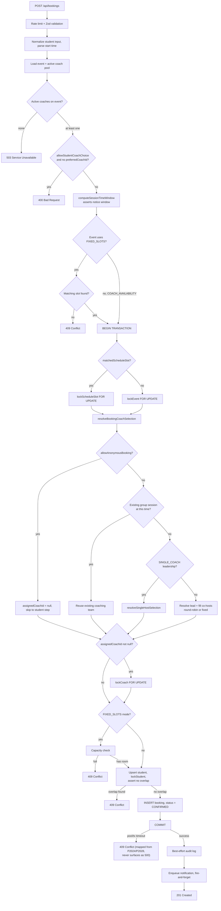
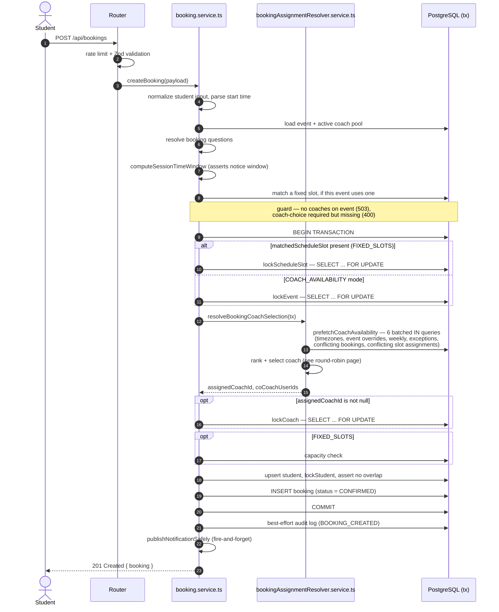

# Booking Creation

Handles a student booking a session against an event. Resolves a coach (or none,
for anonymous events) and writes the booking record atomically under a row lock.
This is the highest-traffic write path in the system, and the one most exposed to
concurrency bugs. See the concurrency section near the bottom.

## Code traces

| Component | File | Key functions |
|---|---|---|
| Route | [`booking.router.ts`](https://github.com/chegg-skills/chegg-scheduling-app-backend/blob/main/backend/src/domain/bookings/booking.router.ts) | `POST /` — `bookingCreationLimiter`, `validate(CreateBookingSchema)` |
| Controller | [`booking.controller.ts`](https://github.com/chegg-skills/chegg-scheduling-app-backend/blob/main/backend/src/domain/bookings/booking.controller.ts) | Thin delegation to the service |
| Service | [`booking.service.ts`](https://github.com/chegg-skills/chegg-scheduling-app-backend/blob/main/backend/src/domain/bookings/booking.service.ts) | `createBooking`, `acquireLocksAndSelectCoach`, `computeSessionTimeWindow` |
| Coach resolver | [`bookingAssignmentResolver.service.ts`](https://github.com/chegg-skills/chegg-scheduling-app-backend/blob/main/backend/src/domain/bookings/bookingAssignmentResolver.service.ts) | `resolveBookingCoachSelection`, `prefetchCoachAvailability` |
| Locking + writes | [`booking.repository.ts`](https://github.com/chegg-skills/chegg-scheduling-app-backend/blob/main/backend/src/domain/bookings/booking.repository.ts) | `lockEvent`, `lockScheduleSlot`, `lockCoach`, `lockStudent`, `createBookingRecord` |
| Notification enqueue | [`notification.publisher.ts`](https://github.com/chegg-skills/chegg-scheduling-app-backend/blob/main/backend/src/shared/notifications/notification.publisher.ts) | `publishNotificationSafely` |

## Full flow, including branches



## Sequence view



## Lock order

`acquireLocksAndSelectCoach` in `booking.service.ts` branches on whether a
schedule slot was matched. It doesn't lock both:

```typescript
if (args.matchedScheduleSlot) {
  await lockScheduleSlot(tx, args.matchedScheduleSlot.id);
} else {
  await lockEvent(tx, args.event.id);
}
// ... resolve coach ...
if (selection.assignedCoachId !== null) {
  await lockCoach(tx, selection.assignedCoachId);
}
```

Across all three booking entry points (create, reschedule, follow-up) the order is
always slot-or-event, then coach, then student. Never both slot and event in the
same request. That consistency is what keeps concurrent transactions safe from
lock-order deadlocks: two requests can never end up each holding what the other
one wants.

Why lock the event or slot at all? `ROUND_ROBIN` assignment ranks coaches by
team-wide booking count, and that ranking only holds up if coach selection and
booking creation commit as one atomic unit before the next concurrent request
reads the same counts. The row lock is what buys that atomicity.

## A concurrency bug we found and fixed here

Every query run inside the transaction has to use the transaction's own client
(`tx`), not the global `prisma` client. There was a bug where the coach
availability lookup queried through the global client while still inside the
locked transaction. Under concurrent load that query needed a second connection
from the database pool, but every other connection was already tied up by
requests queued behind the same lock — so the pool deadlocked and requests started
timing out as HTTP 500s.

The fix was making that query transaction-bound throughout. We confirmed it with a
stress-test script (`backend/src/scripts/dev/concurrent-booking-test.ts`): 20
concurrent requests against a 13-coach pool came back as 13 successes, 7 clean
conflicts, and zero server errors, all in about 600ms.

## Validation and edge cases

| Condition | Status | Where enforced |
|---|---|---|
| No active coaches on the event | 503 | Pre-transaction guard |
| Notice window violated | 400-class | `computeSessionTimeWindow` |
| FIXED_SLOTS request with no matching slot | 409 | Slot-matching step |
| Seat capacity full (FIXED_SLOTS only) | 409 | `assertParticipantCapacityAvailable` |
| Student already has an overlapping booking | 409 | `assertStudentNotOverlapping` |
| Pool/transaction timeout under extreme load | 409, mapped from Prisma `P2024`/`P2028` | `.catch` on the transaction, never surfaces as 500 |

## Related pages

**Reschedule & Cancellation** reuses this same lock skeleton. **Coach Availability
& Round Robin** covers what happens inside `resolveBookingCoachSelection`.
