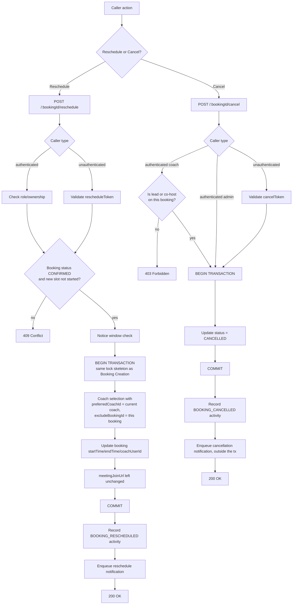
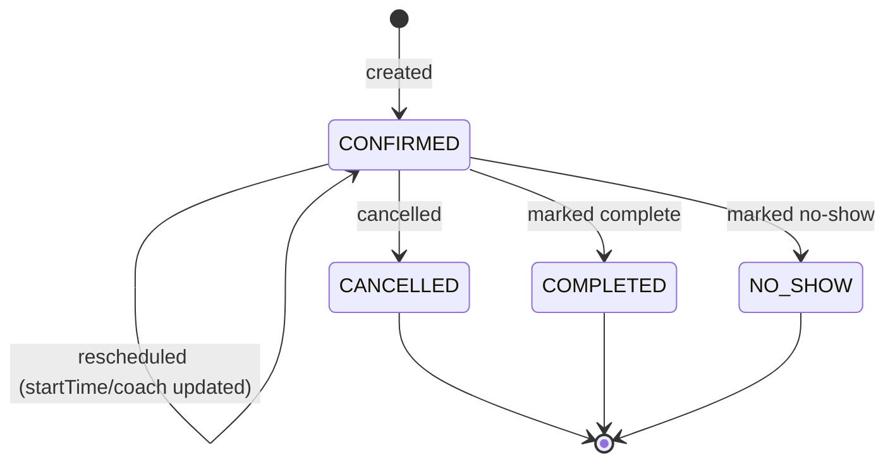

# Reschedule & Cancellation

## Code traces

| Component | File | Key functions |
|---|---|---|
| Routes | [`booking.router.ts`](https://github.com/chegg-skills/chegg-scheduling-app-backend/blob/main/backend/src/domain/bookings/booking.router.ts) | `POST /:bookingId/reschedule`, `POST /:bookingId/cancel` — both `optionalAuthenticate` |
| Service | [`booking.service.ts`](https://github.com/chegg-skills/chegg-scheduling-app-backend/blob/main/backend/src/domain/bookings/booking.service.ts) | `rescheduleBooking`, `cancelBooking` |
| Slot cancellation (admin) | [`eventScheduling.service.ts`](https://github.com/chegg-skills/chegg-scheduling-app-backend/blob/main/backend/src/domain/events/eventScheduling.service.ts) | `cancelEventScheduleSlot` |
| Frontend token handling | [`PublicReschedulePage.tsx`](https://github.com/chegg-skills/chegg-scheduling-app-backend/blob/main/frontend/src/pages/public/PublicReschedulePage.tsx) | Reads `?token=` on mount, strips it from browser history immediately |

## Complete flow overview

## Reschedule

Reuses the same lock skeleton as booking creation (`acquireLocksAndSelectCoach`,
see **Booking Creation**), with two differences:

- `preferredCoachId` defaults to the booking's current coach, so a reschedule
  keeps the same coach when they're still available.
- `excludeBookingId` is threaded through the whole coach-selection and
  conflict-check chain, so the booking's own prior time slot never counts as a
  conflict against itself. Without this, a student rescheduling into an
  overlapping time would be told their coach is unavailable, because of their
  own old booking.

A guard blocks rescheduling a `FIXED_SLOTS` booking into a slot that's already
started.

`meetingJoinUrl` is never recomputed on reschedule. It's a stable pointer, and
`resolveBookingJoinRedirect` resolves whatever coach and time apply dynamically
at click time. Recomputing this field used to be the source of a stale-link bug:
an already-sent confirmation email couldn't reflect a later reassignment if the
link itself changed underneath it. The fix was to stop recomputing it, not to
resend emails on every reschedule.

## Cancellation

Runs inside its own transaction. It validates the cancel token for a public
caller, or the caller's authorization for an authenticated one — a coach can only
cancel sessions where they're the lead or a co-host, checked against both
`coachUserId` and `coCoachUserIds`. It updates status to `CANCELLED`, then fires
cancellation notifications outside the transaction, since a notification-send
failure should never roll back a cancellation that already went through.

Cancelling an `EventScheduleSlot` on the admin side (`cancelEventScheduleSlot`)
cascades to cancel every active booking on that slot in one transaction. That's
for group sessions where the coach or admin cancels the whole session, not just
one student's seat.

## State transitions

## Two ways to authenticate

Both endpoints use `optionalAuthenticate`, which allows either path on the same
route:

1. An authenticated caller — session cookie, checked against role and ownership
   inside the service.
2. An unauthenticated public caller — a `rescheduleToken` or booking-specific
   cancel token, validated against the `Booking` row itself.

The frontend follows the project's own convention for handling that token: read
it from the URL query string on mount, strip it from browser history right away,
hold it only in React state, and send it as a header on the request. It never
sits in the URL long enough to leak through a referrer header or browser
history.
