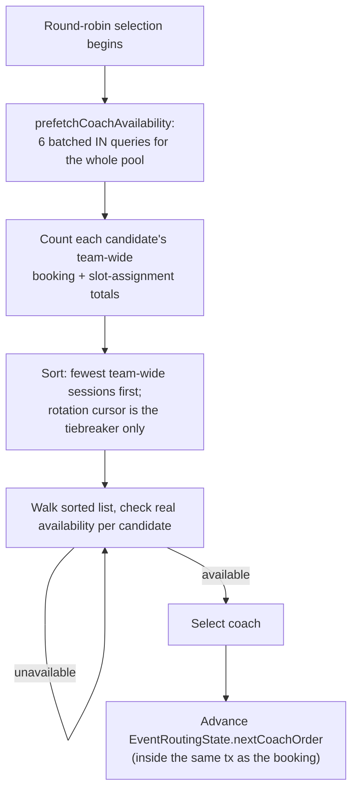

# Coach Availability & Round Robin

## Code traces

| Component | File | Key functions |
|---|---|---|
| Strategy abstraction | [`assignment.service.ts`](https://github.com/chegg-skills/chegg-scheduling-app-backend/blob/main/backend/src/domain/bookings/assignment.service.ts) | `IAssignmentStrategy`, `DirectAssignmentStrategy`, `RoundRobinAssignmentStrategy` |
| Coach resolver | [`bookingAssignmentResolver.service.ts`](https://github.com/chegg-skills/chegg-scheduling-app-backend/blob/main/backend/src/domain/bookings/bookingAssignmentResolver.service.ts) | `resolveBookingCoachSelection`, `prefetchCoachAvailability`, `resolveCollaborativeCoHosts` |
| Availability engine | [`availability.service.ts`](https://github.com/chegg-skills/chegg-scheduling-app-backend/blob/main/backend/src/domain/availability/availability.service.ts) | `evaluateCoachAvailability`, `isCoachAvailable` |
| Conflict detection | [`availabilityConflict.service.ts`](https://github.com/chegg-skills/chegg-scheduling-app-backend/blob/main/backend/src/domain/availability/availabilityConflict.service.ts) | `getCoachConflicts` |

## Strategy pattern

`IAssignmentStrategy` has one method, `resolveCoach()`, with two implementations:

- `DirectAssignmentStrategy` assigns the pinned or primary coach with no
  fallback if they're unavailable. That's a deliberate binding, not an
  interchangeable pool — if the pinned coach is busy, the request fails with
  409 and the client is expected to re-show a slot picker.
- `RoundRobinAssignmentStrategy` load-balances across the pool, covered below.

`getAssignmentStrategy()` picks the implementation from the `AssignmentStrategy`
enum.

## How a coach gets picked

`resolveBookingCoachSelection` is the single entry point all three booking flows
(create, reschedule, follow-up) call. It works through these checks in order:

1. Anonymous event (`event.allowAnonymousBooking`) — returns
   `assignedCoachId: null` immediately, before any selection logic runs. No
   coach is ever attached to the booking. This is distinct from deferred
   reveal; see **Anonymous Booking vs. Deferred Coach Reveal**.
2. An existing group session at this time already has a coach — reuse that
   coaching team instead of re-selecting.
3. `SINGLE_COACH` leadership — one host, via `resolveSingleHostSelection`.
4. Otherwise, multi-coach — resolve a lead (either `FIXED_LEAD` or
   strategy-picked), then fill co-hosts via `resolveCollaborativeCoHosts`,
   which also advances the rotation cursor per co-host assigned. That keeps
   co-host distribution fair even when the lead itself is pinned.

## Round-robin algorithm



A heavily-loaded coach elsewhere in the team gets deprioritized even in a
brand-new event, because the primary sort key is team-wide load, not the
rotation cursor. The cursor only breaks ties among equally-loaded candidates:

```typescript
const sorted = [...candidates].sort((a, b) => {
  const countDiff = (countMap.get(a.coachUserId) ?? 0) - (countMap.get(b.coachUserId) ?? 0);
  if (countDiff !== 0) return countDiff;
  const aRot = a.coachOrder >= routingState.nextCoachOrder ? a.coachOrder : a.coachOrder + maxOrder;
  const bRot = b.coachOrder >= routingState.nextCoachOrder ? b.coachOrder : b.coachOrder + maxOrder;
  return aRot - bRot;
});
```

The cursor advance (`updateRoutingState`) runs inside the same database
transaction as the booking creation. If that transaction rolls back, the cursor
advance rolls back with it, so a failed booking never permanently skews the
rotation.

One coach-count rule worth knowing: exactly 1 coach in a `ROUND_ROBIN` pool is
rejected as a misconfigured state, but 0 coaches is allowed — that's treated as
"still being set up," not an error.

## Bulk availability prefetch

Before the round-robin loop probes any candidate, `prefetchCoachAvailability`
batch-fetches everything the whole pool will need in 6 parallel `IN` queries:
candidate timezones, per-event weekly overrides, global weekly schedules,
one-off exceptions, conflicting bookings, and conflicting slot assignments. This
replaces what used to be up to 4 queries fired per candidate inside the loop,
which, held inside the event's row lock, meant every other concurrent booking
request for that event queued behind the full linear scan. See the
"Concurrency correctness" section on **Booking Creation** for the related
pool-deadlock bug this also helped surface and fix.

On timezones: exception dates are stored as midnight-UTC timestamps but matched
against the session's local calendar day, so the fetch window is widened by 48
hours on each side to cover every IANA offset and cross-midnight sessions
without missing the midnight anchor.

## Availability rule order

`evaluateCoachAvailability` checks these in order, and the first match wins:

1. Existing conflicts — an overlapping `Booking` row or `EventScheduleSlot`
   assignment makes the coach unavailable. A coach is blocked as soon as
   they're assigned to a slot, even before any student has booked it. The
   lookback window is a fixed ~120 minutes, to account for buffers on existing
   bookings.
2. Timezone validity — an invalid coach timezone makes them unavailable, not a
   500.
3. Date exception (`UserAvailabilityException`) — wins over all weekly
   schedules, in either direction. It can grant availability or block it.
4. Event-specific weekly override (`EventCoachWeeklyAvailability`) — overrides
   the coach's global schedule when one exists for that `(eventId, coachUserId)`
   pair.
5. Global weekly schedule (`UserWeeklyAvailability`) — the fallback. This is
   compared using minute-of-day arithmetic, never a string comparison, since a
   string comparison would silently misclassify half-hour-offset timezones.
