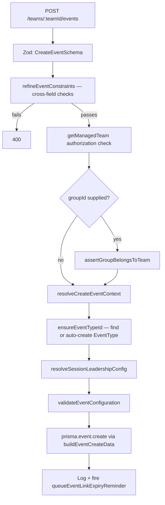

# Event Creation & Management

## Code traces

| Component | File | Key functions |
|---|---|---|
| Routes | [`event.router.ts`](https://github.com/chegg-skills/chegg-scheduling-app-backend/blob/main/backend/src/domain/events/event.router.ts) | 30 routes — event CRUD, event types, coach pool, schedule slots, recurrence |
| Create/update logic | [`eventMutation.service.ts`](https://github.com/chegg-skills/chegg-scheduling-app-backend/blob/main/backend/src/domain/events/eventMutation.service.ts) | `resolveCreateEventContext`, `buildEventCreateData`, `resolveSessionLeadershipConfig` |
| Catalog | [`eventCatalog.service.ts`](https://github.com/chegg-skills/chegg-scheduling-app-backend/blob/main/backend/src/domain/events/eventCatalog.service.ts) | `ensureEventTypeId` |
| Validation | [`event.schema.ts`](https://github.com/chegg-skills/chegg-scheduling-app-backend/blob/main/backend/src/domain/events/event.schema.ts) | `CreateEventSchema`, `UpdateEventSchema`, `refineEventConstraints` |
| Interaction-type caps | [`interactionType.ts`](https://github.com/chegg-skills/chegg-scheduling-app-backend/blob/main/backend/src/shared/constants/interactionType.ts) | `INTERACTION_TYPE_CAPS` |
| Orchestration | [`event.service.ts`](https://github.com/chegg-skills/chegg-scheduling-app-backend/blob/main/backend/src/domain/events/event.service.ts) | `createEvent`, `updateEvent`, `deleteEvent` — largely a barrel composing the files above |

## Creation flow



`EventRoutingState`, the round-robin cursor row, isn't created as part of this
insert. It gets upserted lazily, the first time a coach pool sync or booking
actually needs it (`eventCoach.service.ts`, `eventScheduling.service.ts`).
`getRoutingState` returns an in-memory default (`{ nextCoachOrder: 1 }`) when no
row exists yet, so callers never have to check for its presence explicitly.

## Interaction-type capability matrix

Four fixed shapes, defined as a hardcoded constant rather than a database table,
in `INTERACTION_TYPE_CAPS`:

| `interactionType` | `multipleCoaches` | `multipleParticipants` | `derivesLeadershipFromAssignment` | Practical meaning |
|---|---|---|---|---|
| `ONE_TO_ONE` | false | false | false | Dynamic `COACH_AVAILABILITY` booking. One student, one coach. |
| `ONE_TO_MANY` | false | true | false | Hard-locked to `FIXED_SLOTS`. Group classes, one coach. |
| `MANY_TO_ONE` | true | false | true | Multi-coach panel, one student. |
| `MANY_TO_MANY` | true | true | true | Multi-coach group panel. |

## Automated leadership derivation

When `derivesLeadershipFromAssignment` is true, `sessionLeadershipStrategy` is
always computed — never settable by the caller:

```typescript
if (caps.derivesLeadershipFromAssignment) {
  sessionLeadershipStrategy = (assignmentStrategy === AssignmentStrategy.DIRECT)
    ? SessionLeadershipStrategy.FIXED_LEAD
    : SessionLeadershipStrategy.ROTATING_LEAD;
} else {
  sessionLeadershipStrategy = SessionLeadershipStrategy.SINGLE_COACH;
}
```

## Validation rules (`refineEventConstraints`)

Roughly 15 cross-field rules, keyed off `INTERACTION_TYPE_CAPS`. The ones worth
knowing about:

- `FIXED_LEAD` leadership requires `fixedLeadCoachId`.
- `allowAnonymousBooking` and `deferCoachReveal` are mutually exclusive; an
  event can't have both set. See **Anonymous Booking vs. Deferred Coach
  Reveal**.
- Events where `!multipleParticipants` cap `maxParticipantCount` at 1.
- `useDefaultQuestions === false` requires at least one custom question.
- Anonymous-booking events need a meeting link source whose join URL resolves
  dynamically. Either `EVENT_LOCATION` or `COACH_ISV` works here — both are
  equally safe for anonymity, since the student never gets the coach's raw
  personal link either way (see **Anonymous Booking vs. Deferred Coach
  Reveal**).
- `ROUND_ROBIN` events reject a coach pool of exactly 1, which is treated as
  misconfigured, but 0 coaches is fine as a "still being set up" state.

## Soft delete

In `deleteEvent`, the `Event` row itself is never hard-deleted, so its `Booking`
history stays intact and still points at it. Its `EventCoach`,
`EventScheduleSlot` (which cascades to `SessionLog`/`SessionAttendance`),
`RecurrenceGroup`, and `EventRoutingState` rows get hard-deleted first, and then
the event is marked `deletedAt`, `isActive: false`, and `eventTypeId: null` — the
last one nulled specifically to free up the foreign key so the `EventType` can
be deleted later. Every read path filters on `deletedAt: null`.
