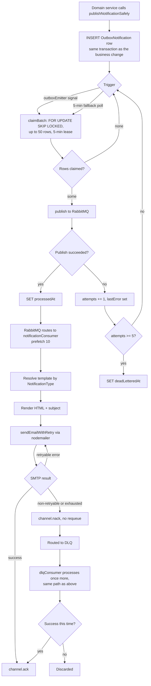
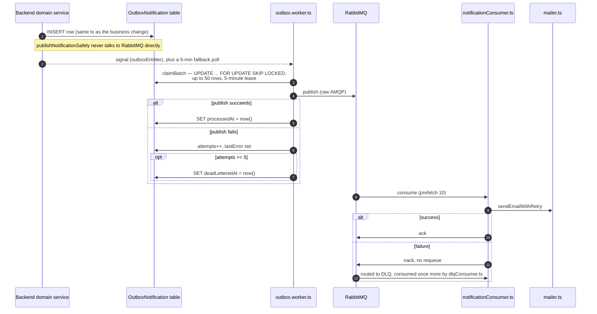

# Notification Service & Transactional Outbox

## Code traces

| Component | File | Key functions |
|---|---|---|
| Outbox publisher (backend) | [`notification.publisher.ts`](https://github.com/chegg-skills/chegg-scheduling-app-backend/blob/main/backend/src/shared/notifications/notification.publisher.ts) | `publishNotificationSafely`, `publishNotification` |
| Outbox worker (backend) | [`outbox.worker.ts`](https://github.com/chegg-skills/chegg-scheduling-app-backend/blob/main/backend/src/shared/notifications/outbox.worker.ts) | `startOutboxWorker`, `claimBatch`, `processRow` |
| RabbitMQ connection | [`rabbitmq.ts`](https://github.com/chegg-skills/chegg-scheduling-app-backend/blob/main/notification-service/src/queues/rabbitmq.ts) | `getRabbitConnection`, exponential-backoff reconnect |
| Main consumer | [`notificationConsumer.ts`](https://github.com/chegg-skills/chegg-scheduling-app-backend/blob/main/notification-service/src/consumers/notificationConsumer.ts) | `startNotificationConsumer` |
| DLQ consumer | [`dlqConsumer.ts`](https://github.com/chegg-skills/chegg-scheduling-app-backend/blob/main/notification-service/src/consumers/dlqConsumer.ts) | `startDLQConsumer` |
| Template registry | [`registry.ts`](https://github.com/chegg-skills/chegg-scheduling-app-backend/blob/main/notification-service/src/templates/registry.ts) | Compile-time exhaustiveness check via `satisfies` |
| Delivery | [`mailer.ts`](https://github.com/chegg-skills/chegg-scheduling-app-backend/blob/main/notification-service/src/services/mailer.ts) | `sendEmailWithRetry` (nodemailer) |

## Complete flow overview



## Why the outbox exists

Publishing straight to RabbitMQ from inside an HTTP request transaction runs
into two failure modes. A RabbitMQ outage forces a choice between rolling back
an otherwise-successful business change or losing the notification outright.
And there's a dual-write race: Postgres commits, then the process crashes
before the message actually reaches the broker. The schema comment on
`OutboxNotification` describes the fix:

> Every notification is enqueued here (by `publishNotificationSafely`) instead of
> going straight to RabbitMQ; a background worker publishes each row, retrying on
> failure. This guarantees no notification is silently lost when RabbitMQ is
> unavailable.

## `OutboxNotification` schema

Fields, from `backend/prisma/schema.prisma`:

```
id                String    @id @default(cuid())
type              String    // notification type, denormalized for inspection
payload           Json      // the full NotificationPayload
notificationKey   String?   // denormalized from payload, for inspection
entityType        String?
entityId          String?
createdAt         DateTime  @default(now())
claimedAt         DateTime? // lease marker for multi-worker FOR UPDATE SKIP LOCKED claim
processedAt       DateTime?
deadLetteredAt    DateTime?
attempts          Int       @default(0)
lastError         String?
```

There's no `status` enum column and no `recipientEmail` column. Recipient
information lives inside the `payload` JSON blob rather than as its own field.

## End-to-end flow



## Claim mechanics

The lease isn't a stored expiry column. It's computed by comparing `claimedAt`
against a cutoff at claim time, so a crashed worker's claimed-but-never-processed
rows become claimable again once the lease window passes (default 5 minutes).
The same mechanism doubles as the retry backoff. An hourly cleanup job prunes
`processedAt`-set rows older than 30 days.

For idempotency, the republished message carries
`notificationKey: payload.notificationKey ?? \`outbox:${row.id}\``, so a retried
or duplicate publish gets deduplicated downstream by the notification-service.

## Template registry

`registry.ts` merges per-domain template maps and checks the result with:

```typescript
const templates = {
  ...inviteTemplates,
  ...teamTemplates,
  ...bookingTemplates,
  ...coachTemplates,
  ...reminderTemplates,
} satisfies Record<Exclude<NotificationType, ControlMessages>, EmailTemplate>;
```

Each domain map is declared with `satisfies Partial<Record<NotificationType, EmailTemplate>>`
instead of a widened type annotation, which keeps its literal key set intact. So
adding a `NotificationType` without a matching template entry fails at `tsc`
build time, not just at runtime — `registry.test.ts` also checks the same
invariant as a second layer, at test time.

## Per-recipient timezones

Notification emails render each recipient's own timezone: the student sees
`booking.timezone`, the coach sees their own `user.timezone`, and team admins
each see their own timezone. No single shared timezone is used across
recipients on the same email batch.

## Delivery and retry

`sendEmailWithRetry` (nodemailer) retries transient failures
(`ECONNRESET`/`ETIMEDOUT`, SMTP 421/450/451) up to 3 times by default, but
throws immediately on classified non-retryable errors instead: rate limits,
authentication failures, and permanent 5xx codes (550-553). A failed send gets
nacked (no requeue) to the DLQ, consumed once more by `dlqConsumer.ts` through
the same processing path, and discarded if it fails a second time. There's no
separate retry-count/backoff loop at the consumer layer beyond that — scheduled
sends (reminders) use their own retry path instead; see **Reminders & Scheduled
Notifications**.
