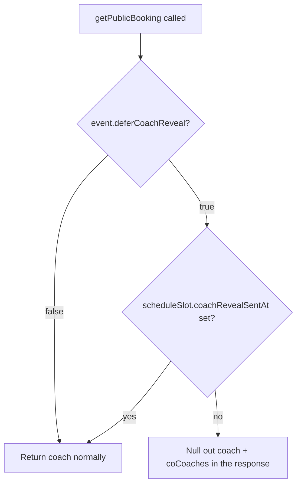

# Anonymous Booking vs. Deferred Coach Reveal

Two separate, mutually exclusive `Event` boolean flags. They get confused
often because both involve "hiding" a coach from a student, but they operate
at completely different layers.

## Code traces

| Component | File | Key functions |
|---|---|---|
| Coach-assignment bypass | [`bookingAssignmentResolver.service.ts`](https://github.com/chegg-skills/chegg-scheduling-app-backend/blob/main/backend/src/domain/bookings/bookingAssignmentResolver.service.ts) | `resolveBookingCoachSelection` |
| Reveal trigger | [`eventScheduling.service.ts`](https://github.com/chegg-skills/chegg-scheduling-app-backend/blob/main/backend/src/domain/events/eventScheduling.service.ts) | `revealCoachForSlot` |
| Public disclosure filter | [`public.service.ts`](https://github.com/chegg-skills/chegg-scheduling-app-backend/blob/main/backend/src/domain/public/public.service.ts) | `getPublicBooking` |
| Mutual-exclusivity check | [`event.schema.ts`](https://github.com/chegg-skills/chegg-scheduling-app-backend/blob/main/backend/src/domain/events/event.schema.ts) | `refineEventConstraints` |

## The two flags, compared

| | `allowAnonymousBooking` | `deferCoachReveal` |
|---|---|---|
| Coach ever assigned to the booking? | No — `resolveBookingCoachSelection` returns `assignedCoachId: null` before any selection logic runs | Yes, assigned normally via round-robin/strategy |
| What's actually hidden? | No coach identity exists to hide | The already-assigned coach's identity, until an explicit reveal |
| Interaction-type scope | Any type | `ONE_TO_MANY` only |
| Meeting link source | Either `EVENT_LOCATION` or `COACH_ISV`. Both resolve the join link dynamically through the booking-level redirect, so neither ever embeds the coach's raw personal link in anything student-facing | Same either/or, unrelated to this flag |
| Can both be true on one event? | No, enforced by Zod schema validation, not just convention |

## Mutual exclusivity, enforced at the schema layer

```typescript
if (data.allowAnonymousBooking && data.deferCoachReveal) {
  ctx.addIssue({
    code: "custom",
    path: ["deferCoachReveal"],
    message: "allowAnonymousBooking and deferCoachReveal are mutually exclusive.",
  });
}
```

An event can't have both flags set. The API rejects it at validation time,
before it ever reaches the database.

## Anonymous booking: the bypass

```typescript
if (event.allowAnonymousBooking) {
  return {
    assignedCoachId: null,
    coCoachUserIds: [],
  };
}
```

This is the first check `resolveBookingCoachSelection` runs, before the
group-session-reuse check, before any round-robin logic, before any database
lock beyond the event/slot lock already held. `Booking.coachUserId` stays
`null` in the database permanently for these bookings.

## Deferred reveal: coach assigned, disclosure gated

Because `deferCoachReveal` is mutually exclusive with `allowAnonymousBooking`,
events using it never hit the bypass above; they go through completely normal
coach assignment. What's gated is disclosure. `EventScheduleSlot.coachRevealSentAt`
controls whether student-facing APIs and emails actually show the coach's name.

`getPublicBooking` nulls out the coach object entirely until that timestamp is set:



## Reveal trigger

`revealCoachForSlot` is triggered by the assigned coach themselves (self-reveal
only), routed through the event's schedule-slot endpoints:

1. Idempotency guard: if `coachRevealSentAt` is already set, it returns early,
   which prevents a duplicate reveal notification.
2. Sets `EventScheduleSlot.coachRevealSentAt = now()`.
3. Syncs `coachUserId` onto the bookings on that slot and queues reveal
   notifications to registered students.

A coach reassignment on an already-revealed slot cascades the new coach's
identity to students. On a not-yet-revealed slot it doesn't, since there's
nothing to cascade — the old coach was never shown in the first place.
