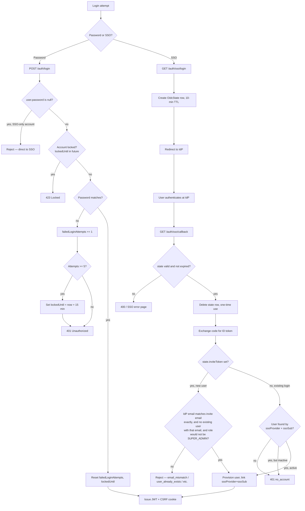
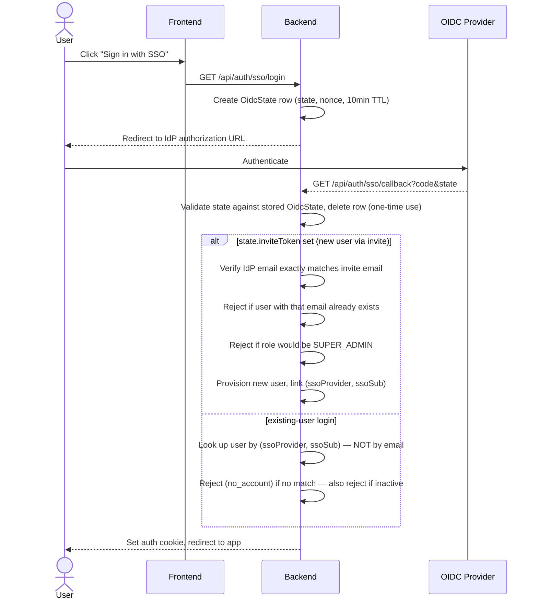

# Authentication, SSO & Invite Onboarding

## Code traces

| Component | File | Key functions |
|---|---|---|
| Password auth | [`auth.service.ts`](https://github.com/chegg-skills/chegg-scheduling-app-backend/blob/main/backend/src/domain/auth/auth.service.ts) | `register`, `login`, `logout`, `bootstrap` |
| SSO controller | [`sso.controller.ts`](https://github.com/chegg-skills/chegg-scheduling-app-backend/blob/main/backend/src/domain/auth/sso.controller.ts) | `initiateLogin`, `initiateInviteAcceptance`, `handleCallback` |
| Auth middleware | [`shared/middleware/auth.ts`](https://github.com/chegg-skills/chegg-scheduling-app-backend/blob/main/backend/src/shared/middleware/auth.ts) | `authenticate`, `optionalAuthenticate`, `authorize` |
| Cookie management | [`shared/auth/cookie.ts`](https://github.com/chegg-skills/chegg-scheduling-app-backend/blob/main/backend/src/shared/auth/cookie.ts) | `setAuthCookie`, `setCsrfCookie` |
| CSRF | [`shared/middleware/csrf.ts`](https://github.com/chegg-skills/chegg-scheduling-app-backend/blob/main/backend/src/shared/middleware/csrf.ts) | Double-submit-cookie check |
| Invites | [`invite.service.ts`](https://github.com/chegg-skills/chegg-scheduling-app-backend/blob/main/backend/src/domain/invite/invite.service.ts) | `createInvite`, `acceptInvite` |

## Complete flow overview



## SSO (OIDC) flow



SSO security rules, all enforced in code rather than left to convention:

- Email must match exactly between the invite and the IdP-returned email.
- `SUPER_ADMIN` accounts can never be created via SSO — checked explicitly.
- If a user with that email already exists, SSO invite acceptance is rejected.
  This stops an SSO invite from silently taking over an existing password
  account.
- Existing-user SSO login looks up by the composite `(ssoProvider, ssoSub)`
  key, never by email, so an identity provider can't impersonate an existing
  user just by asserting a matching email address.

## Password login lockout policy

`login` in `auth.service.ts`:

- If `user.password` is `null` (SSO-only account), password login is rejected
  with a message pointing to SSO, not a generic "wrong password."
- Failed attempts increment `failedLoginAttempts`. At `MAX_FAILED_LOGIN_ATTEMPTS`
  (env-configurable, default 5), the account locks for `LOGIN_LOCKOUT_MINUTES`
  (default 15).
- A successful login resets both `failedLoginAttempts` and `lockedUntil`.

## Per-request role re-verification

`authenticate` doesn't trust the JWT's embedded role claim. On every request
it re-fetches the user from the database and authorizes off that fresh row:

```typescript
const payload = verifyToken(token); // JWT signature only
const user = await prisma.user.findUnique({
  where: { id: payload.sub },
  select: { id: true, email: true, role: true, isActive: true },
});
if (!user || !user.isActive) {
  throw new ErrorHandler(401, "...");
}
res.locals.authUser = user; // never req.user, never the JWT's role claim
```

`User` has no `deletedAt` field in the schema; deactivation is tracked entirely
through `isActive`, not a soft-delete timestamp. The JWT's own `role` claim
exists only as a fallback for a database outage and is never used for an
actual authorization decision.

If an admin revokes a user's permissions or deactivates their account, that
user gets locked out on their very next request, without waiting for the JWT
to expire.

## Cookies and CSRF

- `auth_token` is httpOnly and carries the session JWT. `SameSite` is
  environment-configurable (`lax`/`strict`/`none` via `COOKIE_SAME_SITE`);
  `Secure` is forced whenever `NODE_ENV=production` or `SameSite=none` is in
  effect, since browsers require `Secure` alongside `SameSite=None`.
- `csrf_token` is readable (not httpOnly), so the frontend can echo it back.
- `csrf.ts` verifies state-changing requests (non-GET/HEAD/OPTIONS) include a
  matching `x-csrf-token` header, using a constant-time comparison. It's
  skipped for pre-auth routes (login/register/bootstrap/SSO/accept-invite),
  since there's no existing session to protect on a route that creates a
  brand-new one, and skipped entirely for non-cookie (bearer-token) clients.

## Invite-based onboarding

1. `SUPER_ADMIN` or `TEAM_ADMIN` creates an invite via `POST /api/invites`.
   `TEAM_ADMIN` is restricted to inviting `COACH`-role users only.
2. Token is `crypto.randomBytes(32)` hex.
3. The raw token is never returned in the API response in production; it's
   delivered only through the out-of-band notification email.
4. Invites expire after `INVITE_EXPIRY_DAYS` (default 7). Acceptance is
   rejected if the invite's `requiresSso` is true — those have to go through
   the SSO controller path instead of the password-based accept-invite
   endpoint.
