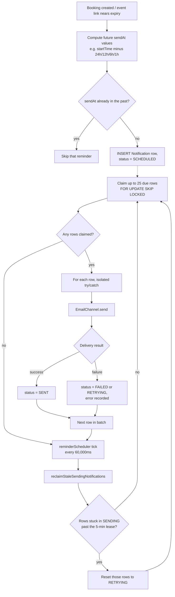
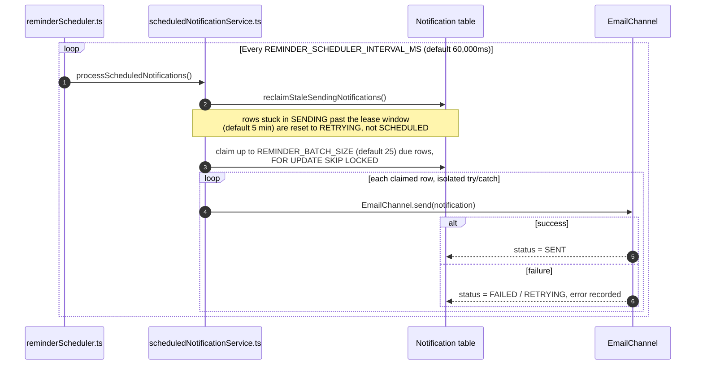

# Reminders & Scheduled Notifications

## Code traces

| Component | File | Key functions |
|---|---|---|
| Scheduler loop | [`reminderScheduler.ts`](https://github.com/chegg-skills/chegg-scheduling-app-backend/blob/main/notification-service/src/scheduler/reminderScheduler.ts) | `startReminderScheduler` |
| Batch processing | [`scheduledNotificationService.ts`](https://github.com/chegg-skills/chegg-scheduling-app-backend/blob/main/notification-service/src/services/scheduledNotificationService.ts) | `processScheduledNotifications` |
| Claim/reclaim queries | [`notificationRepository.ts`](https://github.com/chegg-skills/chegg-scheduling-app-backend/blob/main/notification-service/src/services/notificationRepository.ts) | `claimDueScheduledNotifications`, `reclaimStaleSendingNotifications` |
| Delivery | [`EmailChannel.ts`](https://github.com/chegg-skills/chegg-scheduling-app-backend/blob/main/notification-service/src/channels/EmailChannel.ts) | `EmailChannel.send` |

## Complete flow overview



## Reminders live in the `Notification` table

Reminders are rows in the notification-service's own `Notification` table
(`notification-service/prisma/schema.prisma`, a separate database from the
backend), distinguished by a future `sendAt` and a `NotificationStatus` of
`SCHEDULED`. There's no separate `ScheduledNotification` table. The full
status enum: `PENDING`, `SCHEDULED`, `SENDING`, `SENT`, `FAILED`, `RETRYING`,
`CANCELLED`.

## Polling loop



The sweep timer is `.unref()`'d so it never keeps the process alive on its
own, and a `sweepInProgress` flag prevents overlapping runs if one sweep takes
longer than the interval.

## Orphan reclamation

If a worker instance crashes mid-send, its claimed rows sit in `SENDING`
status indefinitely unless reclaimed. `reclaimStaleSendingNotifications` runs
on every sweep, before claiming new work:

```sql
UPDATE "Notification"
SET status = 'RETRYING', "sendAt" = now(), "updatedAt" = now()
WHERE status = 'SENDING'
  AND "lastAttemptAt" < $cutoff  -- now() minus the lease window
```

The lease window (`NOTIFICATION_SEND_LEASE_MS`) defaults to 5 minutes, not a
round 10. Reclaimed rows go to `RETRYING` (immediately due again), not back to
`SCHEDULED`.

## Row-level failure isolation

Each notification in a batch is processed in its own try/catch, so one bad
send (a malformed email, a transient SMTP error) never aborts the rest of the
sweep.

## What actually gets scheduled this way

Session reminders (`SESSION_REMINDER_24H`, `_12H`, `_6H`, `_1H`, and anonymous
variants) are persisted as `SCHEDULED` rows with a future `sendAt` at
booking-creation time. They aren't delivered immediately off the RabbitMQ
queue the way a confirmation email is — this scheduler sweep is their only
delivery mechanism.

Meeting-link expiry warnings follow the same pattern: for events using
`meetingLinkSource: EVENT_LOCATION` or `COACH_ISV`, the system watches
`locationLinkExpiresAt`/`zoomIsvLinkExpiresAt` against each event/coach's
configured reminder-days lead time and schedules a warning notification to the
coach or admin ahead of expiry, prompting a link renewal before it silently
breaks student-facing sessions.

## Related pages

The reminder scheduler is one of two async delivery paths in the system — the
other is the transactional outbox described in **Notification Service &
Transactional Outbox**. Reminders skip the outbox entirely; they're written
directly as `SCHEDULED` `Notification` rows in the
notification-service's own database, not routed through the backend's
`OutboxNotification` table.
