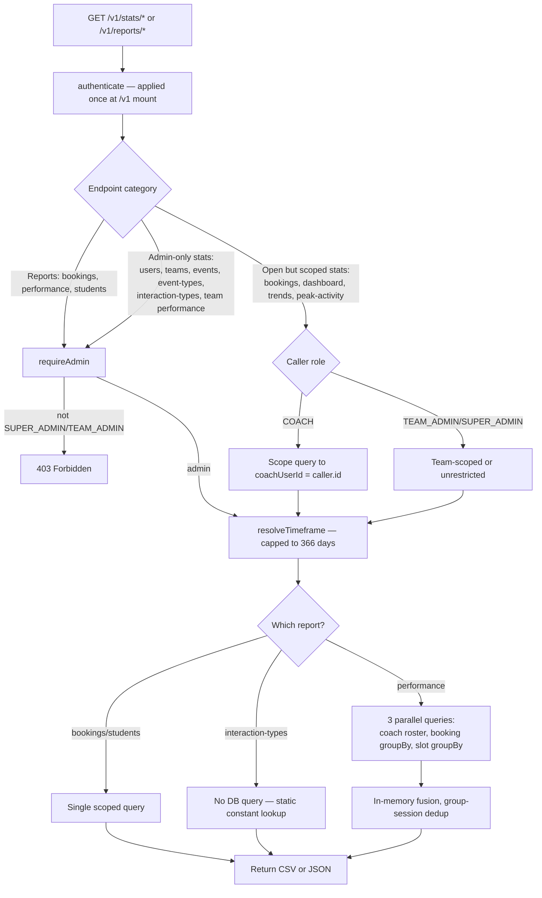
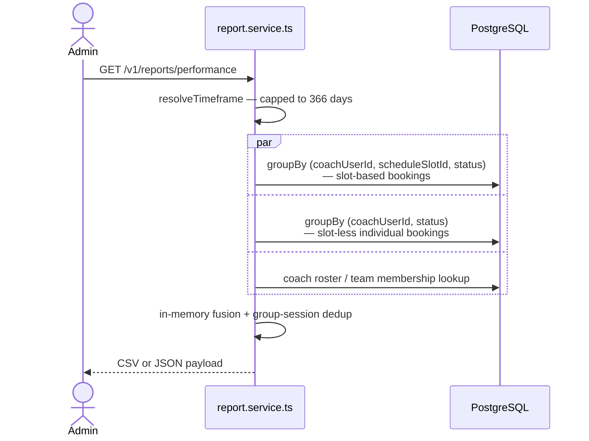

# Analytics, Reports & Dashboards

Two related but distinct domains. Reports produce exportable row-level data
(CSV/JSON); stats produce aggregate dashboard numbers. Both live under
`/api/v1` and share a timeframe-resolution helper.

## Code traces

| Component | File | Key functions |
|---|---|---|
| Reports | [`report.service.ts`](https://github.com/chegg-skills/chegg-scheduling-app-backend/blob/main/backend/src/domain/reports/report.service.ts) | `getBookingsReport`, `getPerformanceReport`, `getStudentReport` |
| Stats | [`stats.service.ts`](https://github.com/chegg-skills/chegg-scheduling-app-backend/blob/main/backend/src/domain/stats/stats.service.ts) | `getDashboardStats`, `getBookingTrends`, `getPeakActivity`, `getTeamPerformance`, and 6 more |
| Shared helpers | [`stats.shared.ts`](https://github.com/chegg-skills/chegg-scheduling-app-backend/blob/main/backend/src/domain/stats/stats.shared.ts) | `resolveTimeframe`, `requireAdmin` |

## Complete flow overview

## Authorization lives in the service, not the router

Neither the `reports` nor `stats` router applies an `authorize()` role gate.
The whole `/v1` mount applies `authenticate` once, and individual endpoints
call `requireAdmin(caller)` from `stats.shared.ts` internally where admin-only
access is required. Some stats endpoints are intentionally open to all
authenticated roles but coach-scoped rather than admin-gated:

| Endpoint | Access |
|---|---|
| `getBookingStats`, `getDashboardStats`, `getBookingTrends`, `getPeakActivity` | Any role; `COACH` callers see only `coachUserId: caller.id` |
| `getUserStats`, `getTeamStats`, `getEventStats`, `getEventTypeStats`, `getInteractionTypeStats`, `getTeamPerformance` | `requireAdmin` — `SUPER_ADMIN`/`TEAM_ADMIN` only |
| All three report endpoints (`/bookings`, `/performance`, `/students`) | `requireAdmin` |

## `getPerformanceReport`: fixed 3-query fan-out

Per-coach performance metrics used to require a per-coach query loop. The
current implementation runs 3 fixed parallel queries regardless of coach
count:

Grouping by `(coachUserId, scheduleSlotId, status)` specifically avoids
double-counting: a group session with one slot and N attendees counts as one
session per coach, not N.

## Timeframe bounding

`resolveTimeframe` (`stats.shared.ts`) caps date-range parameters to prevent
unbounded full-table scans. Custom ranges are capped at 366 days, and the
"all time" option is capped to a 365-day lookback with an open upper bound
(so upcoming bookings still show). This applies uniformly to both reports and
stats.

## Interaction-type stats are computed, not queried

`getInteractionTypeStats` doesn't hit the database for its counts. The four
interaction types are hardcoded constants (see **Event Creation & Management**),
so this endpoint returns static derived numbers (`activeInteractionTypes: 4`,
`multiCoachEnabled: 2`, `roundRobinEnabled: 4`) directly from the constant
map.
