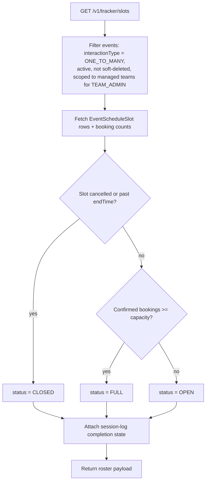

# Group Session Tracker

An admin operational roster, scoped to `ONE_TO_MANY` (group) sessions only —
not a general-purpose booking tracker.

## Code traces

| Component | File | Key functions |
|---|---|---|
| Service | [`tracker.service.ts`](https://github.com/chegg-skills/chegg-scheduling-app-backend/blob/main/backend/src/domain/tracker/tracker.service.ts) | `getTrackerSlots`, `getSessionDates`, `getTrackerFilters` |
| Scope constant | same file | `TRACKER_INTERACTION_TYPES = [InteractionType.ONE_TO_MANY]` |

The scope constant carries a code comment marking it as an "extensibility
point" — adding more interaction types to the tracker is a one-line change,
but today it covers `ONE_TO_MANY` only. Every tracker endpoint requires
`SUPER_ADMIN` or `TEAM_ADMIN` (`requireTrackerAccess`).

## What it actually shows

For a given day or date range, `getTrackerSlots` returns one row per
`EventScheduleSlot`: team, event, event type, assigned coach, computed recurrence
position within its series, booking count vs. capacity, a computed status, and
session-log completion state.

## Supporting endpoints

- `getSessionDates` returns distinct `YYYY-MM-DD` strings for dates with at
  least one qualifying slot, so the admin calendar picker can highlight active
  days without downloading a full slot payload for every day of the month.
- `getTrackerFilters` returns the teams and `ONE_TO_MANY` events available to
  populate the tracker's filter dropdowns, scoped to the caller's managed
  teams for `TEAM_ADMIN`.

Both date-range endpoints cap the queryable span at 366 days, with a code
comment noting the tracker UI itself never needs more than 365 — the cap is
there to reject out-of-band direct API calls, not to constrain normal usage.
