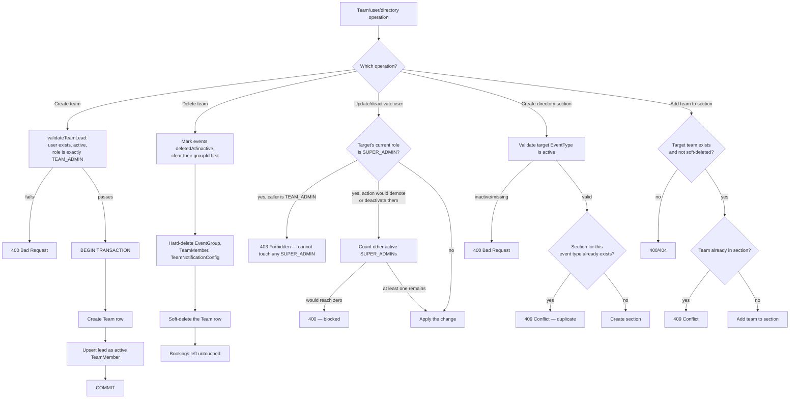

# Teams, Roles & Directory Management

## Code traces

| Component | File | Key functions |
|---|---|---|
| Team service | [`team.service.ts`](https://github.com/chegg-skills/chegg-scheduling-app-backend/blob/main/backend/src/domain/teams/team.service.ts) | `createTeam`, `validateTeamLead`, `deleteTeam`, `listTeams`, `updateTeam` |
| Directory service | [`bookingDirectory.service.ts`](https://github.com/chegg-skills/chegg-scheduling-app-backend/blob/main/backend/src/domain/bookingDirectories/bookingDirectory.service.ts) | `createBookingDirectory`, `addSection`, `addTeamToSection`, `removeSection`, `removeTeamFromSection` |
| User service | [`user.service.ts`](https://github.com/chegg-skills/chegg-scheduling-app-backend/blob/main/backend/src/domain/users/user.service.ts) | `updateUser`, `deleteUser` |

## Complete flow overview

## Team lead validation

`validateTeamLead` requires the designated `teamLeadId` to be an existing,
active user whose role is exactly `TEAM_ADMIN` — not `SUPER_ADMIN`, and not
`COACH`. A `SUPER_ADMIN` can't be assigned as a team's lead.

## Team creation and lead membership

`createTeam` wraps team creation and auto-adding the lead as an active
`TeamMember` in one transaction, so a team can never exist without its lead
already being a member. If a team's `teamLeadId` changes later, `updateTeam`
re-validates the new lead and re-upserts their membership inside the same
transaction as the update.

## Team visibility scoping (`listTeams`)

Role-scoped, not a flat list for everyone:

- `SUPER_ADMIN` sees all teams.
- `TEAM_ADMIN` sees only teams they lead (`teamLeadId === caller.id`).
- `COACH` sees only teams where they're an active member.

## Soft-delete cascade (`deleteTeam`)

Team deletion is a soft delete (`deletedAt` set on the `Team` row), but several
dependent records are hard-deleted first:

1. Events under the team are marked `deletedAt`/inactive, and their `groupId` is
   cleared first — required because the `Event.groupId` foreign key is
   `onDelete: Restrict`.
2. `EventGroup`, `TeamMember`, and `TeamNotificationConfig` rows for the team are
   hard-deleted.
3. The `Team` row itself is soft-deleted.

Bookings are never touched by this cascade — historical booking data survives
a team deletion intact, even though the team and its events are gone from
normal views.

## Last-admin protection

Before demoting or deactivating a `SUPER_ADMIN`, `user.service.ts` counts
other currently-active `SUPER_ADMIN` accounts and blocks the action if it
would leave zero active super admins in the system. This check applies to
both role changes (`updateUser`) and deactivation (`deleteUser`) — the system
can't be locked out of admin access by its own admin tooling. A `TEAM_ADMIN`
caller additionally can't touch any user whose current role is `SUPER_ADMIN`
at all, regardless of this guard; that restriction is checked separately and
first.

## Public booking directories

`BookingDirectory` models a multi-team public landing page:

- A directory contains ordered `BookingDirectorySection` rows, each tied to one
  `EventType`.
- Each section contains ordered `BookingDirectoryTeam` rows.
- `addSection` validates the target `EventType` is active before attaching, and
  rejects a duplicate section for an event type already in the directory
  (`@@unique([bookingDirectoryId, eventTypeId])`, mapped to a friendly error).
- `addTeamToSection` validates the target team exists and isn't soft-deleted.

All booking-directory endpoints require `SUPER_ADMIN`, checked both at the router
and redundantly inside every service function.
