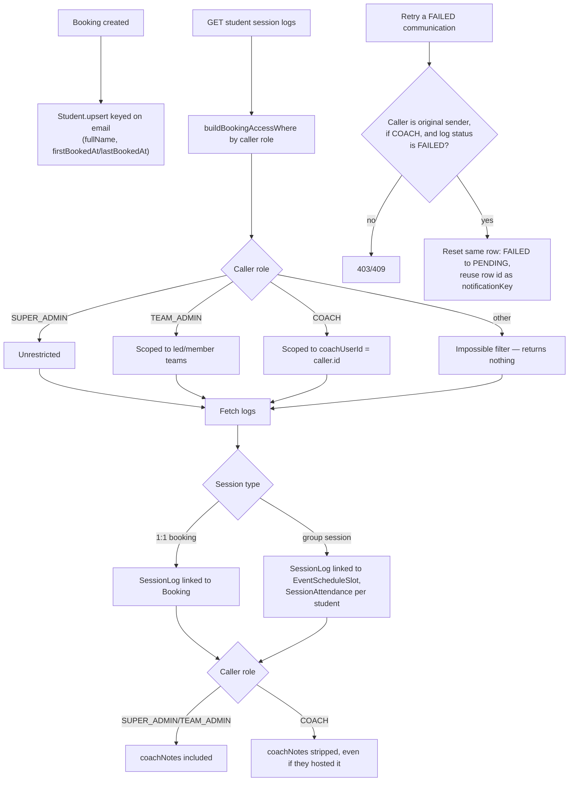

# Student History & Session Logging

## Code traces

| Component | File | Key functions |
|---|---|---|
| Student service | [`student.service.ts`](https://github.com/chegg-skills/chegg-scheduling-app-backend/blob/main/backend/src/domain/students/student.service.ts) | `buildBookingAccessWhere`, `listStudentSessionLogs`, `sendStudentEmail`, `retryEmailDispatch` |
| Upsert (booking-time) | [`booking.repository.ts`](https://github.com/chegg-skills/chegg-scheduling-app-backend/blob/main/backend/src/domain/bookings/booking.repository.ts) | `upsertStudentForBooking` |
| Activity timeline | [`bookingActivity.service.ts`](https://github.com/chegg-skills/chegg-scheduling-app-backend/blob/main/backend/src/domain/bookings/bookingActivity.service.ts) | `recordBookingActivity` |

## Complete flow overview



## Student identity: no password account

Students never register. `Student.email` is `@unique`; the record is created or
updated by upsert on every booking:

```typescript
await tx.student.upsert({
  where: { email: studentEmail },
  update: { fullName: studentName, lastBookedAt: bookedAt },
  create: { fullName: studentName, email: studentEmail, firstBookedAt: bookedAt, lastBookedAt: bookedAt },
});
```

The schema field is `fullName`, not `name`.

## Data scoping (`buildBookingAccessWhere`)

Students are visible only through the lens of bookings the caller can see;
there's no independent "student list" permission:

- `SUPER_ADMIN` is unrestricted.
- `TEAM_ADMIN` is scoped to bookings under teams they lead or are an active
  member of.
- `COACH` is scoped to `coachUserId: caller.id`.
- Any other caller gets an impossible filter, returning nothing.

## Session logging: 1:1 vs. group

- 1:1 sessions: `SessionLog` links directly, 1:1, to a `Booking` row.
- Group sessions: `SessionLog` links 1:1 to the `EventScheduleSlot` instead,
  so a coach writes one summary for the whole group session while individual
  attendance is tracked separately per student via `SessionAttendance.attended`
  (boolean, one row per booking).

## `coachNotes` privacy

`listStudentSessionLogs` gates the `coachNotes` field specifically:
`SUPER_ADMIN`/`TEAM_ADMIN` see it, `COACH` doesn't, even for a session they
personally hosted. Private administrative notes are restricted to team
managers by design, not an oversight.

## Communication retry: same row, not a new one

`retryEmailDispatch` resets an existing `StudentCommunicationLog` row in place
(`FAILED` → `PENDING`) rather than creating a new log entry, and reuses that
row's id as the outbox `notificationKey`. This keeps exactly one card per
email in the Communications tab, and means the notification-service's
delivery-feedback consumer updates that same row on the retry's outcome
instead of creating a duplicate. Only the original sender (if a `COACH`) may
retry their own send, and only a `FAILED` log can be retried.

## Booking activity timeline

Every significant booking lifecycle event writes a `BookingActivity` row —
`BOOKING_CREATED`, `BOOKING_RESCHEDULED`, `BOOKING_CANCELLED`, `SESSION_COMPLETED`,
`SESSION_NO_SHOW`, `COACH_REASSIGNED`, `SESSION_LOGGED`, `FOLLOW_UP_BOOKED`, and
others — each carrying an `actorType` (`STUDENT`/`COACH`/`ADMIN`/`SYSTEM`), an
optional `actorUserId`, a denormalized `actorName` snapshot (survives the actor's
name changing later), and a free-form `metadata` JSON field. Recording is
consistently best-effort, wrapped in try/catch everywhere it's called, since a
failed audit write must never turn an already-applied booking change into an
error for the caller.
