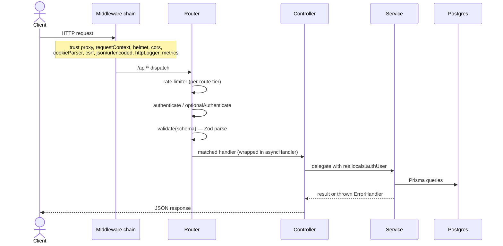
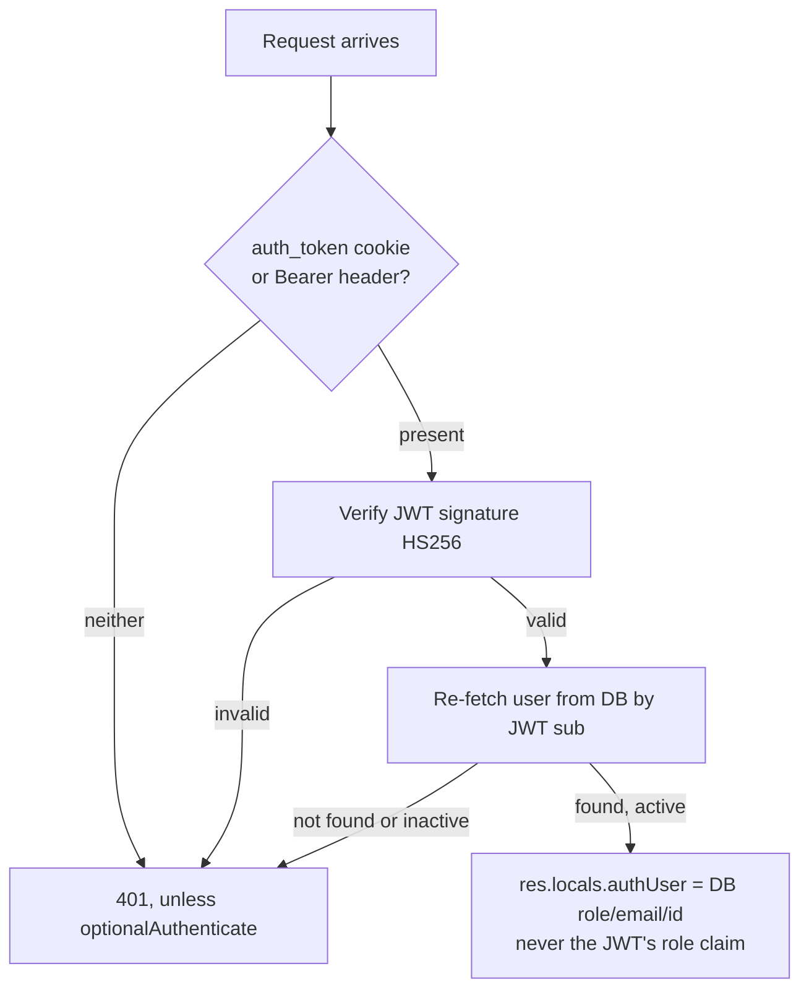
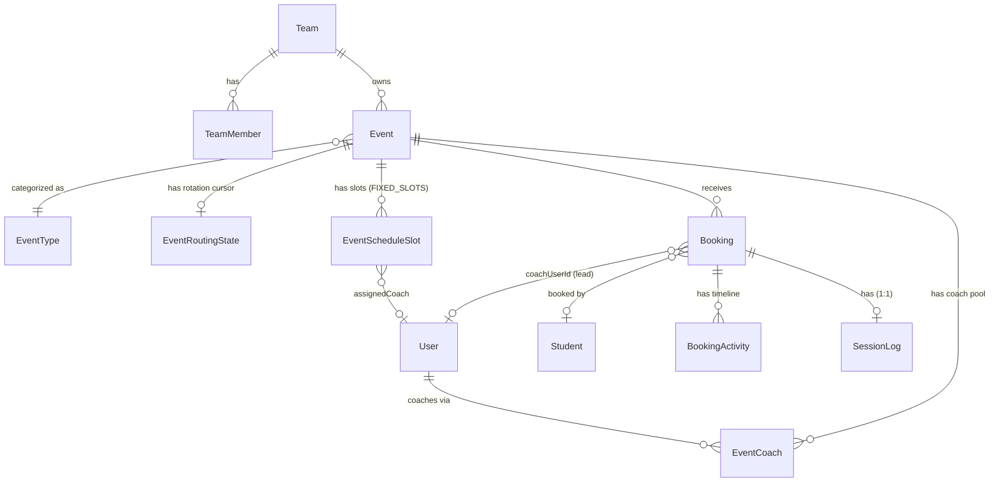

# Chegg Scheduling Platform — Master Specification

Checked against the repository. See the Scheduling App root page for the full
page index and how this space is verified. Feature-level detail (business logic,
execution flow, edge cases) lives in the numbered pages, not here. This page
covers what's shared across all of them: stack, architecture, data model, and
platform-wide concerns.

---

## 1. Overview

A meeting/session scheduling platform for organizations running coach-led
sessions with students. Admins and team leads configure events (bookable session
types) with rules for who can attend, how coaches are assigned, and how
availability is computed. Students book, reschedule, and cancel sessions through
a public, unauthenticated booking flow.

Three independently deployable services, confirmed via each service's own
`package.json` and `Dockerfile`:

- `backend/` — Express 5 REST API, Prisma ORM against PostgreSQL
- `frontend/` — React 18 SPA, built with Vite
- `notification-service/` — Node worker consuming RabbitMQ, sending email via SMTP

## 2. Tech stack

### Language and runtime

Every service is TypeScript, running on Node.js for backend and
notification-service, or compiled to browser JS via Vite for the frontend. No
other language shows up in the application layer; SQL migrations are the only
non-JS/TS source files. Nothing in this repository documents why this stack was
chosen over an alternative like Java, so treat any such rationale offered
elsewhere as commentary rather than history.

What we can say from observing the code: the workload traced throughout this
space (booking locks, availability checks, coach selection) is I/O-bound rather
than CPU-bound, which is exactly the kind of work Node's event loop handles
cheaply without the per-connection thread overhead of a traditional servlet
model. Prisma's generated types also give end-to-end type safety from
`schema.prisma` straight through to application code, with no separate DTO layer
in between.

### Backend

| Category | Package | Confirmed via |
|---|---|---|
| Web framework | `express` ^5.2.1 | `backend/package.json` |
| ORM | `@prisma/client` + `@prisma/adapter-pg` ^7.7.0 | Driver adapter uses `pg` directly, not Prisma's binary engine |
| Validation | `zod` ^4.3.6 | `validate.ts` middleware. Frontend pins zod ^3.23.8, a different major version, so schemas aren't shared |
| Auth | `bcrypt`, `jsonwebtoken`, `openid-client` | Password hashing, JWT sessions, OIDC SSO |
| Rate limiting | `express-rate-limit` + `rate-limit-redis` | Redis-backed in production |
| Queue | `amqplib` ^0.10.9 | RabbitMQ publish (outbox worker) and consume (feedback) |
| Observability | `@sentry/node`, `prom-client`, `pino` | Error tracking, `/metrics`, structured logs |

Redis's only consumer we could find is the rate limiter
(`shared/middleware/rateLimit.ts`, backed by `shared/redis/redisClient.ts`).
There's no session cache in Redis; sessions are stateless JWTs in an httpOnly
cookie.

### Frontend

| Category | Package | Confirmed via |
|---|---|---|
| UI framework | `react`/`react-dom` ^18.3.1, `@mui/material` ^7 | |
| Server state | `@tanstack/react-query` ^5.56.0 | The only data layer — no Redux/Zustand/MobX in `package.json` |
| HTTP client | `axios` | Cookie-based auth (`withCredentials: true`), CSRF interceptor in `lib/axios.ts` |
| Forms | `react-hook-form` + `@hookform/resolvers` (zodResolver) | |
| Routing | `react-router-dom` ^6.26.2 | `createBrowserRouter`, wrapped by Sentry |

### Notification Service

`nodemailer` ^8.0.5 handles SMTP delivery — no SES or SendGrid SDK anywhere.
`@prisma/client` talks to its own, separate PostgreSQL database (confirmed: two
distinct `prisma/schema.prisma` files, no cross-schema relations).

## 3. Architecture

### Module structure (backend)

```
domain/     One folder per feature (auth, bookings, events, availability, teams,
            users, students, invite, public, reports, stats, tracker, eventGroups,
            bookingDirectories, systemSettings, teamMembers, config) — 17 total.
            Convention per domain: *.router.ts, *.controller.ts, *.service.ts,
            *.schema.ts. Data access is service-embedded (Prisma called directly
            in *.service.ts), with one exception — bookings has its own
            booking.repository.ts.
routes/     index.ts mounts each domain router. v1/ holds stats, reports, and
            tracker, mounted under `authenticate` applied once at the mount
            point. Per this codebase's own convention (CLAUDE.md), new endpoints
            go under /v1 — it's the current direction, not a legacy namespace.
shared/     auth/, middleware/, error/, http/, notifications/, redis/, logging/
```

### Request flow



### Authentication



The user gets re-fetched from the database on every request, so role changes and
deactivations take effect immediately rather than waiting for the token to
expire. The JWT's own `role` claim is only a fallback for a database outage; it's
never trusted for an actual authorization decision. Full SSO sequence:
**Authentication, SSO & Invite Onboarding**.

### Background workers

Two separate mechanisms, covered in full on **Notification Service &
Transactional Outbox** and **Reminders & Scheduled Notifications**:

1. Transactional outbox (backend) — domain code never publishes to RabbitMQ
   directly. It writes an `OutboxNotification` row in the same transaction as
   the business change, and a separate worker publishes it, retrying on
   failure.
2. Reminder scheduler (notification-service) — polls for `SCHEDULED` rows with
   a due `sendAt`, on a fixed interval.

## 4. Domain model

Full field-level detail is in the schema file itself
(`backend/prisma/schema.prisma`). Core relationships:



The interaction-type capability matrix is a hardcoded map, not a database table
(`backend/src/shared/constants/interactionType.ts`):

| `interactionType` | `multipleCoaches` | `multipleParticipants` | `derivesLeadershipFromAssignment` |
|---|---|---|---|
| `ONE_TO_ONE` | false | false | false |
| `ONE_TO_MANY` | false | true | false |
| `MANY_TO_ONE` | true | false | true |
| `MANY_TO_MANY` | true | true | true |

`multipleParticipants: true` hard-locks `bookingMode` to `FIXED_SLOTS`.
`derivesLeadershipFromAssignment: true` means `sessionLeadershipStrategy` is
always computed from `assignmentStrategy` and can't be set manually. More detail
on **Event Creation & Management**.

Soft delete exists on `Event` and `Team` only. `User` and `Student` have no
`deletedAt` field in the schema at all. Deleting an event or team preserves its
booking history; deleting a team hard-deletes dependent `TeamMember`/`EventGroup`
rows but never touches bookings.

## 5. Database

Two separate PostgreSQL databases. Backend and notification-service each own a
distinct `prisma/schema.prisma` with no cross-schema foreign keys between them —
they're correlated only informally, through matching
`notificationKey`/`entityType`/`entityId` values.

Backend has 68 migrations, chronological, tracking real schema evolution (for
example `add_deferred_coach_reveal`, `add_anonymous_booking`,
`add_outbox_notification`). CI runs a migration-drift check on every push
(`prisma migrate diff --exit-code` against a freshly-migrated database) to catch
schema/migration mismatches before merge.

A few notable constraints from the schema:
- `EventCoach`: `@@unique([eventId, coachUserId])`, `@@unique([eventId, coachOrder])`
- `Booking`: `@@index([studentEmail, status, startTime, endTime])`, backing the
  student double-booking check
- `EventScheduleSlot`: `@@unique([eventId, startTime])`
- `EventRoutingState.eventId`: `@unique` — one rotation cursor per event

## 6. Testing

| Service | Command | Notes |
|---|---|---|
| Backend | `npm test` / `test:unit` / `test:integration` / `test:coverage` | Single Jest config, split via `--testPathPattern` rather than separate configs. Runs `--runInBand`, serialized. Coverage gate: statements ≥70%, branches ≥50%, functions ≥65%, lines ≥70% |
| Frontend | `npm test` (`vitest run`) | MSW mocks all API calls; `onUnhandledRequest: 'error'` means any un-stubbed request fails the test |
| Notification Service | `npm test` | Dependency-free — no Prisma or amqplib imports in any test file, which matches CI: no DB/queue container is provisioned for this service |

Test-DB setup (`backend/tests/setup/globalSetup.js`) runs real migrations
(`prisma migrate deploy`) rather than a schema snapshot, so tests run against the
same migration path production does. Isolation between suites comes from an
FK-ordered `deleteMany()` sweep, not per-test transactions.

## 7. Coding standards

Only patterns we could actually find in the code are listed here.

- Strategy pattern — `IAssignmentStrategy` in `assignment.service.ts`, with two
  implementations selected by `getAssignmentStrategy()`. See **Coach
  Availability & Round Robin**.
- Repository pattern, one exception rather than the default. `bookings` is the
  only domain with a dedicated repository. Every other domain we checked
  (`events`, `teams`) calls Prisma directly inside its own `*.service.ts`.
- Row-level pessimistic locking — four `SELECT ... FOR UPDATE` helpers in
  `booking.repository.ts`, always acquired in a fixed order.
- Transactional outbox — see **Notification Service & Transactional Outbox**.
- No DI container. Confirmed absent from `package.json` (no inversify or
  tsyringe). Services just import the singleton Prisma client directly.
- No formal Factory pattern. A repo-wide search for `*Factory`-named
  classes/modules found none — `validate()`, `authorize()`, and
  `asyncHandler()` are closure-returning middleware functions, a lighter idiom
  than a GoF Factory.

Formatting, per `CLAUDE.md`: frontend uses single quotes, no semicolons,
printWidth 100. Backend and notification-service use double quotes, semicolons,
printWidth 100.

## 8. Deployment

- Docker: `backend/Dockerfile` and `notification-service/dockerfile`
  (lowercase) both build slim two-stage images and run `prisma migrate deploy`
  on container start, so migrations aren't a separate deploy step. There's no
  frontend Dockerfile and no root `docker-compose.yml` — local dev runs all
  three services in separate terminals.
- CI (`.github/workflows/ci.yml`) is validation-only: build, lint, test, audit.
  No deployment step. Three parallel jobs, one per service.
- Health checks: backend has `/health` (liveness) and `/health/ready` (DB and
  RabbitMQ check, 503 if either is down). Notification-service has an
  equivalent pair on its own `HEALTH_PORT`.

## 9. Known limitations

Only limitations we found direct evidence for are listed here.

- The coach conflict-check lookback is fixed at roughly 120 minutes. A buffer
  configured larger than that could miss a real conflict.
- `DIRECT` coach assignment has no fallback. If the pinned coach becomes
  unavailable because of a concurrent booking, the request fails with 409
  instead of falling back to another coach. That's deliberate, not a bug, but
  clients need to be ready to re-show a slot picker.
- There's no documented rationale for the `/api` vs `/api/v1` split. The
  structural fact (auth applied once at the `/v1` mount) is confirmed; why
  these three domains specifically live there isn't stated anywhere in the
  codebase.
- Backend and notification-service each maintain their own copy of the
  `NotificationType` union (`notification.publisher.ts` and
  `types/notification.ts` respectively), not a shared import. They have to be
  kept in sync by hand, and different audits turned up different member
  counts, so they may already have drifted — worth a direct diff before
  relying on either one.
- Frontend and backend Zod major versions differ (^3.23.8 vs ^4.3.6), so
  validation schemas can't be shared or generated from one source.
