# Booking Creation Flow — `POST /api/bookings`

Complete request-to-response sequence for a student booking a session, including
every function call, DB query, and row lock. Reschedule and follow-up bookings
follow the same locking skeleton (see [Related flows](#related-flows)).

## File map

| Layer | File | Role |
|---|---|---|
| Router | `backend/src/domain/bookings/booking.router.ts` | Rate limit + Zod validation |
| Controller | `backend/src/domain/bookings/booking.controller.ts` | Unwraps body, delegates |
| Service | `backend/src/domain/bookings/booking.service.ts` | Orchestration + transaction |
| Coach resolver | `backend/src/domain/bookings/bookingAssignmentResolver.service.ts` | Who gets the session (incl. `prefetchCoachAvailability` batch prefetch) |
| Strategies | `backend/src/domain/bookings/assignment.service.ts` | DIRECT / ROUND_ROBIN algorithms + rotation cursor |
| Availability | `backend/src/domain/availability/availability.service.ts` | `isCoachAvailable` → `evaluateCoachAvailability` |
| Conflicts | `backend/src/domain/availability/availabilityConflict.service.ts` | `getCoachConflicts`, `filterConflictsForSlot` |
| Repository | `backend/src/domain/bookings/booking.repository.ts` | Row locks (`SELECT … FOR UPDATE`) + insert |

## Locking model (why the transaction looks the way it does)

- **One event = one row lock** (`lockEvent`) in COACH_AVAILABILITY mode; fixed-slot
  events serialize on the slot row (`lockScheduleSlot`) instead. This makes coach
  selection + booking insert atomic — required because ROUND_ROBIN ranks coaches by
  booking *count*, which is only correct if each booking commits before the next
  request selects.
- **Every query inside the transaction must use `tx`.** A global-`prisma` query
  inside the locked transaction needs a second pool connection while all other
  connections are held by requests queued on that same lock — a pool deadlock
  (this was the root cause of 500s under concurrent load; fixed 2026-07).
- Lock order is always **slot/event → coach → student**, so concurrent transactions
  can never hold locks in opposite orders (no lock-order deadlock).
- `maxWait: 10000` lets a burst queue for a connection; `P2024`/`P2028` timeouts
  are mapped to a retryable **409**, never a 500.

## Call flow diagram (flowchart)

```mermaid
graph TD
    %% Define Styles
    classDef router fill:#3b82f6,stroke:#1d4ed8,stroke-width:2px,color:#fff;
    classDef controller fill:#10b981,stroke:#047857,stroke-width:2px,color:#fff;
    classDef service fill:#6366f1,stroke:#4338ca,stroke-width:2px,color:#fff;
    classDef resolver fill:#f59e0b,stroke:#b45309,stroke-width:2px,color:#fff;
    classDef strategy fill:#8b5cf6,stroke:#6d28d9,stroke-width:2px,color:#fff;
    classDef db fill:#ef4444,stroke:#b91c1c,stroke-width:2px,color:#fff;

    %% ------------------ ROUTER & CONTROLLER LAYER ------------------
    subgraph Router_Controller [Router & Controller Layer]
        Entry([HTTP POST /api/bookings]) --> Zod[validate CreateBookingSchema]
        Zod --> Ctrl[BookingController.createBooking]
    end

    %% ------------------ SERVICE LAYER (PRE-TX) ------------------
    subgraph Booking_Service_PreTx [Booking Service — Pre-Transaction Prep]
        Ctrl --> S_Create[BookingService.createBooking]
        
        %% Normalizations
        S_Create --> NormName[normalizeStudentName]
        S_Create --> NormEmail[normalizeStudentEmailAddress]
        S_Create --> ParseStart[parseBookingStartTime]
        
        %% Event Preparation
        ParseStart --> GetEvent[getBookableEvent]
        GetEvent --> Q1[(Query 1: findBookableEvent)]
        Q1 --> Q2[(Query 2: TeamMember.findMany)]
        
        %% Question Resolution
        Q2 --> ResolveQuestions[resolveBookingQuestions]
        ResolveQuestions --> Q3[(Query 3: getDefaultQuestionTexts)]
        
        %% Window & Slots
        Q3 --> ResolveWindow[computeSessionTimeWindow]
        ResolveWindow --> NoticeGuard[assertBookingNoticeSatisfied]
        NoticeGuard --> ResolveSlotCtx[matchScheduleSlotForBooking]
        ResolveSlotCtx --> Q4[(Query 4: resolveMatchingScheduleSlot)]
    end

    %% ------------------ TRANSACTION PHASE ------------------
    subgraph Booking_Service_Tx [Prisma Transaction Scope — tx client]
        Q4 --> BeginTx[prisma.$transaction]
        BeginTx --> S_LockGate[acquireLocksAndSelectCoach]
        
        %% Locking Flow
        S_LockGate --> LockSlotCheck{Is FIXED_SLOTS?}
        LockSlotCheck -- Yes --> Q5_Slot[(Query 5: lockScheduleSlot - FOR UPDATE)]
        LockSlotCheck -- No --> Q5_Event[(Query 5: lockEvent - FOR UPDATE)]
        
        %% Coach Resolver Integration
        Q5_Slot --> Resolver_Start[resolveBookingCoachSelection]
        Q5_Event --> Resolver_Start
        
        Resolver_Start --> Q6[(Query 6: Booking.findFirst - group session check)]
        Q6 --> Q6b[(Query 6b: eventScheduleSlot.findUnique)]
        
        %% Coach Data Prefetch
        Q6b --> BuildDataMap[prefetchCoachAvailability]
        BuildDataMap --> Q7_Prefetch[(Queries 7-12: batch-fetch timezones, overrides, weekly, exceptions, conflicts)]
        
        %% Single vs Multi Coach
        Q7_Prefetch --> CoachStrategyCheck{Event Leadership?}
        
        CoachStrategyCheck -- SINGLE_COACH --> ResolverSingle[resolveSingleHostSelection]
        CoachStrategyCheck -- Multi-Coach --> ResolverMulti[resolveFixedLead / resolveStrategyLead]
        
        %% Round Robin Routing Routing cursor
        ResolverSingle --> StrategyResolve[strategy.resolveCoach]
        ResolverMulti --> StrategyResolve
        
        StrategyResolve --> Q13[(Query 13: eventRoutingState.findUnique)]
        Q13 --> Q14_15[(Queries 14-15: groupBy workload session counts)]
        Q14_15 --> CheckAvailable[isCoachAvailable - 0 DB queries from prefetch map]
        CheckAvailable --> Q16[(Query 16: eventRoutingState.upsert - update cursor)]
        
        %% Return Selected Coaches
        Q16 --> ResolveCoHosts[resolveCollaborativeCoHosts]
        ResolveCoHosts --> CoachSelectDone[assignedCoachId & coCoachUserIds resolved]
        
        %% Lock Assigned Coach
        CoachSelectDone --> Q17[(Query 17: lockCoach - SELECT FOR UPDATE)]
        
        %% Capacity check
        Q17 --> Q18[(Query 18: resolveMatchingScheduleSlot - if no pre-match)]
        Q18 --> Q19[(Query 19: countActiveParticipantsForTime - seats count)]
        Q19 --> CapacityGuard[assertParticipantCapacityAvailable]
        
        %% Student overlap checks
        CapacityGuard --> Q20[(Query 20: upsertStudentForBooking)]
        Q20 --> Q21[(Query 21: lockStudent - SELECT FOR UPDATE)]
        Q21 --> Q22[(Query 22: assertStudentNotOverlapping)]
        
        %% Final booking insertion
        Q22 --> JoinUrl[buildStudentJoinUrl]
        JoinUrl --> Q23[(Query 23: createBookingRecord - INSERT Booking)]
        Q23 --> Commit([Commit & Release Locks])
    end

    %% ------------------ POST-TRANSACTION ACTIONS ------------------
    subgraph Post_Tx [Post-Transaction — Fire & Forget]
        Commit --> Q24[(Query 24: recordBookingActivity - audit trail)]
        Q24 --> Q25[(Query 25: eventScheduleSlot.findUnique - reveal timestamp)]
        Q25 --> Q26[(Query 26: queueBookingCreatedNotifications - Outbox Message)]
        Q26 --> ReturnResponse([HTTP 201 Created])
    end

    %% Assign Node Classes
    class Entry,Zod router;
    class Ctrl controller;
    
    class S_Create,NormName,NormEmail,ParseStart,GetEvent,ResolveQuestions,ResolveWindow,NoticeGuard,ResolveSlotCtx,BeginTx,S_LockGate,LockSlotCheck,CapacityGuard,JoinUrl,Commit,ReturnResponse service;
    
    class Resolver_Start,BuildDataMap,CoachStrategyCheck,ResolverSingle,ResolverMulti,ResolveCoHosts,CoachSelectDone resolver;
    
    class StrategyResolve,CheckAvailable strategy;
    
    class Q1,Q2,Q3,Q4,Q5_Slot,Q5_Event,Q6,Q6b,Q7_Prefetch,Q13,Q14_15,Q16,Q17,Q18,Q19,Q20,Q21,Q22,Q23,Q24,Q25,Q26 db;
```

## Sequence diagram

```mermaid
sequenceDiagram
    autonumber
    actor Client
    participant R as booking.router.ts
    participant C as booking.controller.ts
    participant BS as booking.service.ts
    participant BSR as bookingAssignmentResolver.service.ts
    participant AS as assignment.service.ts
    participant AV as availability.service.ts
    participant DB as PostgreSQL (Prisma)

    %% ------------------ PRE-TRANSACTION PHASE ------------------
    Note over Client, DB: 1. PRE-TRANSACTION PREPARATION (read-only, global prisma client)
    Client->>R: POST /api/bookings (payload)
    R->>R: bookingCreationLimiter (10 req / 15 min per IP)
    R->>R: validate(CreateBookingSchema) — Zod
    R->>C: BookingController.createBooking
    C->>BS: BookingService.createBooking(req.body)

    rect rgb(240, 248, 255)
        BS->>BS: normalizeStudentName / normalizeStudentEmailAddress
        BS->>BS: parseBookingStartTime (5-min grace period)
        BS->>DB: [Q1] findBookableEvent — event + coach pool (bookableEventInclude)
        DB-->>BS: Event & coach candidates (404 if missing/inactive, 400 if wrong team)
        BS->>DB: [Q2] teamMember.findMany — drop coaches no longer active team members
        DB-->>BS: Active member ids
        opt event.useDefaultQuestions
            BS->>DB: [Q3] getDefaultQuestionTexts (systemBookingQuestion.findMany)
            DB-->>BS: Global question texts (answers validated / index-aligned)
        end
        BS->>BS: computeSessionTimeWindow — end = start + duration,<br/>assertBookingNoticeSatisfied (no DB)
        BS->>DB: [Q4] resolveMatchingScheduleSlot — slot at this startTime?
        DB-->>BS: matchedScheduleSlot | null (FIXED_SLOTS with no match → 409)
        BS->>BS: guards — no active coaches → 503,<br/>allowStudentCoachChoice && !preferredCoachId → 400
    end

    %% ------------------ TRANSACTION PHASE ------------------
    Note over Client, DB: 2. TRANSACTION (maxWait 10s, timeout 15s — ALL queries use tx)
    BS->>DB: prisma.$transaction BEGINS

    rect rgb(255, 240, 245)
        BS->>BS: acquireLocksAndSelectCoach(tx, …)
        alt matchedScheduleSlot (FIXED_SLOTS)
            BS->>DB: [Q5] lockScheduleSlot — SELECT slot FOR UPDATE
        else COACH_AVAILABILITY mode
            BS->>DB: [Q5] lockEvent — SELECT event FOR UPDATE<br/>(serializes all concurrent bookings for this event)
        end
        DB-->>BS: Row locked (concurrent requests queue here)

        BS->>BSR: resolveBookingCoachSelection(tx)

        opt event.allowAnonymousBooking
            BSR-->>BS: { assignedCoachId: null } — no coach, skip to Q18
        end
        opt multipleParticipants interaction type (ONE_TO_MANY / MANY_TO_MANY)
            BSR->>DB: [Q6] booking.findFirst — group session already at this time?
            DB-->>BSR: If found → reuse existing coaching team, return early<br/>(FIXED_SLOTS: slot.findUnique re-checks authoritative assignedCoachId)
        end
        opt SINGLE_COACH + matched slot
            BSR->>DB: [Q6b] eventScheduleSlot.findUnique — slot.assignedCoachId
            DB-->>BSR: If set → return that coach early (skips prefetch below)
        end

        Note over BSR, DB: Batch prefetch — replaces ~4 queries PER coach candidate
        BSR->>DB: [Q7–Q12] prefetchCoachAvailability — 6 IN-clause queries for the whole pool:<br/>timezones (user), event overrides (eventCoachWeeklyAvailability),<br/>weekly (userWeeklyAvailability), exceptions ±48h (userAvailabilityException),<br/>conflicting bookings (booking), conflicting slot assignments (eventScheduleSlot)
        DB-->>BSR: per-coach prefetch map (conflicts pre-filtered via filterConflictsForSlot)

        alt Single-coach event (SINGLE_COACH leadership)
            BSR->>BSR: resolveSingleHostSelection<br/>(preferred coach honored: DIRECT = pinned/no fallback,<br/>ROUND_ROBIN = keep if free, else fall through to strategy)
        else Multi-coach event (FIXED_LEAD / ROTATING_LEAD)
            BSR->>BSR: resolveFixedLeadSelection or resolveStrategyLead (lead)<br/>then resolveCollaborativeCoHosts (co-hosts)
        end

        Note over AS, DB: ROUND_ROBIN strategy (lead selection)
        BSR->>AS: strategy.resolveCoach(candidates, context)
        AS->>DB: [Q13] getRoutingState — eventRoutingState.findUnique (rotation cursor)
        AS->>DB: [Q14, Q15] groupBy team-wide booking + slot-assignment counts
        DB-->>AS: Load-balancing data
        AS->>AS: sort candidates: fewest sessions first, cursor as tiebreaker
        loop each candidate until one is free
            AS->>AV: isCoachAvailable(candidate) — timezone, exceptions,<br/>weekly windows, conflicts — ALL from prefetch map (0 queries)
        end
        AS->>DB: [Q16] updateRoutingState — eventRoutingState.upsert (WRITE:<br/>advances cursor, atomic with the booking because it's inside this tx)
        AS-->>BSR: assignedCoachId
        opt Multi-coach: co-host loop
            BSR->>DB: getRoutingState + updateRoutingState per assigned co-host<br/>(cursor advances for every co-host — fair rotation even with fixed lead)
        end
        BSR-->>BS: { assignedCoachId, coCoachUserIds }

        opt assignedCoachId !== null
            BS->>DB: [Q17] lockCoach — SELECT user FOR UPDATE<br/>(blocks concurrent fixed-slot bookings of the same coach)
        end

        opt No pre-matched slot
            BS->>DB: [Q18] resolveMatchingScheduleSlot(tx) — re-check inside the lock
        end
        opt FIXED_SLOTS
            BS->>DB: [Q19] countActiveParticipantsForTime — seat-capacity check<br/>(assertParticipantCapacityAvailable → 409 when full)
        end

        BS->>DB: [Q20] upsertStudentForBooking — create/update student profile
        BS->>DB: [Q21] lockStudent — SELECT student FOR UPDATE<br/>(serializes same-student bookings across DIFFERENT events)
        BS->>DB: [Q22] assertStudentNotOverlapping — student double-booking check → 409
        BS->>BS: generate bookingId + sessionToken → buildStudentJoinUrl
        BS->>DB: [Q23] createBookingRecord — INSERT booking (CONFIRMED)
        DB-->>BS: SafeBooking record

        alt Success
            BS->>DB: COMMIT — all row locks released
        else Prisma P2024 / P2028 (pool or tx timeout under extreme load)
            BS-->>Client: 409 "This time slot is currently busy. Please try again."
        end
    end

    %% ------------------ POST-TRANSACTION PHASE ------------------
    Note over Client, DB: 3. POST-TRANSACTION (best-effort — never fails the booking)
    rect rgb(240, 255, 240)
        BS->>DB: [Q24] recordBookingActivity — BOOKING_CREATED audit row<br/>(try/catch: logged, never thrown)
        opt event.deferCoachReveal && scheduleSlotId
            BS->>DB: [Q25] eventScheduleSlot.findUnique — coachRevealSentAt
        end
        BS--)DB: [Q26] queueBookingCreatedNotifications — outbox INSERT<br/>(fire-and-forget void - outbox worker publishes to RabbitMQ,<br/>survives a RabbitMQ outage)
    end

    BS-->>C: SafeBooking
    C-->>Client: 201 Created { booking }
```

## Error responses at a glance

| Condition | Status | Where |
|---|---|---|
| Event missing / inactive | 404 | `getBookableEvent` |
| Event not in team / coach choice required | 400 | pre-transaction guards |
| No active coaches on event | 503 | pre-transaction guard |
| FIXED_SLOTS time matches no slot | 409 | `matchScheduleSlotForBooking` |
| Booking notice window violated | 4xx | `assertBookingNoticeSatisfied` |
| No coach available at this time | 409 | strategy / `assertHostAvailability` |
| Slot at seat capacity | 409 | `assertParticipantCapacityAvailable` |
| Student already booked at this time | 409 | `assertStudentNotOverlapping` |
| Pool/transaction timeout under load | 409 | `P2024`/`P2028` catch |

## Related flows

`rescheduleBooking` and `bookFollowUpSession` (same service file) reuse the exact
transaction skeleton via `acquireLocksAndSelectCoach`, with two deltas:

- **Reschedule** passes `preferredCoachId = booking.coachUserId` (keep the same
  coach when possible) and `excludeBookingId = booking.id` (the booking's own old
  time must not count as a conflict against itself), then `UPDATE`s instead of
  `INSERT`s. Transaction timeout is 30s.
- **Follow-up** passes `preferredCoachId = originalBooking.coachUserId`, requires a
  non-null coach (409 for anonymous sessions), and re-verifies the coach is still
  active + assigned to the event after acquiring the coach lock.
