# Event Creation Flow — `POST /api/teams/:teamId/events`

Complete request-to-response sequence for an admin creating a new event type, including validation rules, dynamic category creation, leadership strategy derivation, and public URL slug generation.

## File map

| Layer | File | Role |
|---|---|---|
| Router | `backend/src/domain/events/event.router.ts` | Rate limit + Zod validation + Auth guard |
| Validation | `backend/src/shared/middleware/validate.ts` | `Object.defineProperty` request param mutation ([doc](../request-validation-middleware.md)) |
| Controller | `backend/src/domain/events/event.controller.ts` | Unwraps params/body, delegates to service |
| Service | `backend/src/domain/events/event.service.ts` | Team authorization & DB creation orchestration |
| Mutation Engine | `backend/src/domain/events/eventMutation.service.ts` | Category resolution, leadership strategy matrix, & create payload builder |
| Scheduling Config | `backend/src/domain/events/eventScheduling.service.ts` | Booking mode resolution (`FIXED_SLOTS` vs `COACH_AVAILABILITY`) |
| Coach Validator | `backend/src/domain/events/eventCoach.service.ts` | Validates coach pool constraints |
| Notifications | `backend/src/domain/events/event.notification.ts` | Link expiry reminder worker queueing |

---

## Call flow diagram (flowchart)

```mermaid
graph TD
    %% Define Styles
    classDef router fill:#3b82f6,stroke:#1d4ed8,stroke-width:2px,color:#fff;
    classDef controller fill:#10b981,stroke:#047857,stroke-width:2px,color:#fff;
    classDef service fill:#6366f1,stroke:#4338ca,stroke-width:2px,color:#fff;
    classDef mutation fill:#f59e0b,stroke:#b45309,stroke-width:2px,color:#fff;
    classDef db fill:#ef4444,stroke:#b91c1c,stroke-width:2px,color:#fff;

    %% ------------------ ROUTER & CONTROLLER LAYER ------------------
    subgraph Route_Layer [Router & Controller Layer]
        Entry([HTTP POST /api/teams/:teamId/events]) --> Zod[validate CreateEventSchema]
        Zod --> AuthCheck[authenticate & authorize user]
        AuthCheck --> Ctrl[eventController.createEvent]
    end

    %% ------------------ SERVICE LAYER ------------------
    subgraph Service_Layer [Event Service — Access & Validation]
        Ctrl --> S_Create[eventService.createEvent]
        S_Create --> TeamGuard[getManagedTeam — verify user manages teamId]
        TeamGuard --> GroupGuard{Has groupId?}
        GroupGuard -- Yes --> AssertGroup[assertGroupBelongsToTeam]
        GroupGuard -- No --> ResolveCtx[resolveCreateEventContext]
        AssertGroup --> ResolveCtx
    end

    %% ------------------ MUTATION ENGINE ------------------
    subgraph Context_Resolution [Mutation Engine — eventMutation.service.ts]
        ResolveCtx --> EnsureType[ensureEventTypeId — find or auto-create EventType]
        EnsureType --> DeriveLeadership[resolveSessionLeadershipConfig — leadership matrix]
        DeriveLeadership --> ValidateConfig[validateEventConfiguration]
        ValidateConfig --> ResolveSched[resolveEventSchedulingConfig — FIXED_SLOTS vs COACH_AVAILABILITY]
        ResolveSched --> BuildData[buildEventCreateData]
        BuildData --> GenSlug[createPublicBookingSlug — URL slug generator]
    end

    %% ------------------ DATABASE & SIDE EFFECTS ------------------
    subgraph DB_And_SideEffects [Database & Side Effects]
        GenSlug --> DBCreate[(prisma.event.create)]
        DBCreate --> LogInfo[Structured Logger — Event Created]
        LogInfo --> LinkReminder[queueEventLinkExpiryReminder — optional link expiry job]
        LinkReminder --> ReturnRes([HTTP 201 Created — SafeEvent])
    end

    %% Assign Node Classes
    class Entry,Zod,AuthCheck router;
    class Ctrl controller;
    class S_Create,TeamGuard,GroupGuard,AssertGroup service;
    class ResolveCtx,EnsureType,DeriveLeadership,ValidateConfig,ResolveSched,BuildData,GenSlug mutation;
    class DBCreate,LogInfo,LinkReminder,ReturnRes db;
```

---

## Detailed Step-by-Step Breakdown

### Step 1: Authorization & Team Guard
* **Function**: `getManagedTeam(teamId, caller)` in `backend/src/domain/events/event.shared.ts`
* **What it does**: Ensures that the caller making the request is an active `SUPER_ADMIN` or a `TEAM_ADMIN` on the specified `teamId`.

### Step 2: Dynamic Event Category Resolution
* **Function**: `ensureEventTypeId(idOrName, callerId)` in `backend/src/domain/events/eventMutation.service.ts`
* **What it does**: 
  * If the caller passes an existing category UUID, it uses it directly.
  * If the caller passes a plain string name (e.g. `"Mock Interviews"`), it normalizes the key and automatically creates a new `EventType` record in the database on the fly.

### Step 3: Session Leadership & Capability Matrix
* **Function**: `resolveSessionLeadershipConfig` in `backend/src/domain/events/eventMutation.service.ts`
* **What it does**: Determines how leadership works based on the `interactionType`:

| Interaction Type | Default Leadership | Strategy Derivation |
|---|---|---|
| **`ONE_TO_ONE`** | `SINGLE_COACH` | 1 Host per session |
| **`ONE_TO_MANY`** (Group Class) | `SINGLE_COACH` | 1 Host for up to N students |
| **`MANY_TO_ONE`** (Panel Interview) | `ROTATING_LEAD` | Multiple hosts (1 Lead + Co-hosts) |
| **`MANY_TO_MANY`** (Group Panel) | `ROTATING_LEAD` | Multiple hosts + multiple students |

* **Rule**: If `derivesLeadershipFromAssignment` is true, a `DIRECT` assignment strategy forces `FIXED_LEAD` leadership, while `ROUND_ROBIN` forces `ROTATING_LEAD`.

### Step 4: Booking Mode & Notice Resolution
* **Function**: `resolveEventSchedulingConfig` in `backend/src/domain/events/eventScheduling.service.ts`
* **What it does**: 
  * Enforces **`FIXED_SLOTS`** mode for all multi-participant sessions (`ONE_TO_MANY` / `MANY_TO_MANY`) because group sessions require pre-created calendar blocks with seat caps.
  * Defaults 1-on-1 sessions to **`COACH_AVAILABILITY`** (dynamic rolling availability).

### Step 5: Public URL Slug & Data Payload Generation
* **Function**: `buildEventCreateData` in `backend/src/domain/events/eventMutation.service.ts`
* **What it does**:
  1. Generates a unique, collision-free URL slug via `createPublicBookingSlug(name, "event")` (e.g. `frontend-assessment-6a0b6a`).
  2. Maps custom questions, location types (Virtual/Custom/In-Person), and link expiration limits.
  3. If a `fixedLeadCoachId` was specified, it automatically attaches that coach to the `EventCoach` database table with `coachOrder: 1`.

### Step 6: Database Creation & Post-Creation Side Effects
* **Function**: `createEvent` in `backend/src/domain/events/event.service.ts`
* **What it does**:
  1. Executes `prisma.event.create` with full relations included (`coaches`, `team`, `group`, `eventType`).
  2. Emits a structured log (`Event created`).
  3. Executes `queueEventLinkExpiryReminder(event)`: If the virtual meeting link has a set expiration date, it schedules a background reminder to alert the event manager before the link expires.

---

## Error responses at a glance

| Condition | Status | Where |
|---|---|---|
| Caller not admin/member of team | 403 / 404 | `getManagedTeam` |
| `groupId` does not belong to `teamId` | 400 | `assertGroupBelongsToTeam` |
| Invalid `eventTypeId` | 400 / 404 | `resolveCreateEventContext` |
| Invalid coach count / leadership config | 400 | `validateEventConfiguration` |
